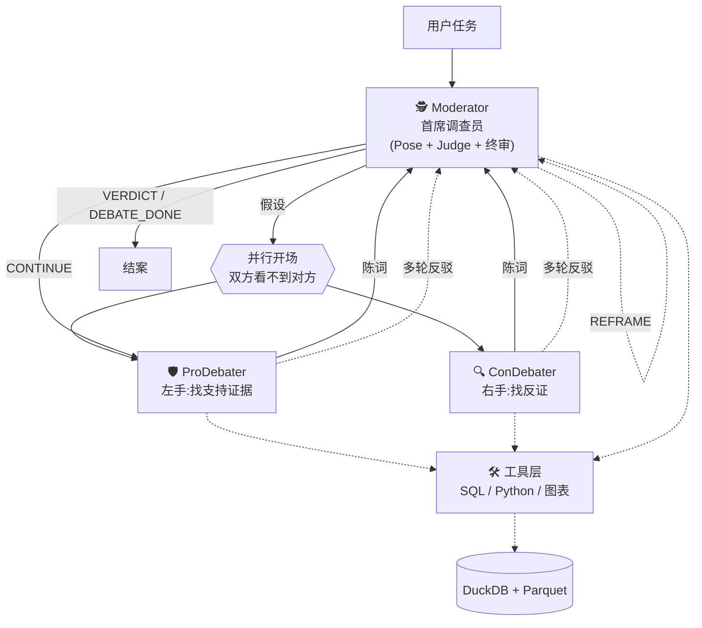

# 让调查员带两个分析师吵架:一种更靠谱的 LLM 安全分析架构

---

## 一个极其普通的场景

你手上有 14 天的 HTTP 请求日志,118 万条记录。简单跑一下正则,告诉你 **18,140 条请求含 SQL 注入 payload**。9% 以上的流量看起来像攻击。

如果你把这份数据丢给 ChatGPT / Claude / 任何单 LLM agent,问它"这到底是真攻击还是扫描噪音",十有八九会得到:

> 这批请求来自 `10.49.21.15`,UA 含 `webscan eagle_eye` 标识,payload 中有 `sha1(0x360webscan)` 固定指纹。判定为**合规漏洞扫描**,建议加白名单。

听起来很自信,言之凿凿。但这个回答里藏着**三个被忽略的问题**:

1. 这些 payload 里有没有**不是 POC 而是真正的利用型** SQL?
2. 14 天里,这个 IP **有没有**从"发探测 payload"升级到"真的利用成功"?
3. **除了这个 IP**,还有没有其他 source_ip 也在发 SQLi?

单 agent 不会自己给自己提这些问题。它是**表面模式匹配器** —— 看到 `webscan` 特征 → 输出 "benign" 标签,模式匹配的闭环太漂亮,它没有停下来反向验证的冲动。

本文要描述的,是一套**强制停下来反向验证**的系统。

---

## 架构一句话版本

> **一个首席调查员(Moderator)指挥两个对抗分析师(Pro / Con)针对同一份数据独立找证据,调查员综合对抗结果做判断,直到找出一个核心安全问题为止。**

三个 agent,都用 Qwen3.6-plus,都有 DuckDB SQL + Python 沙箱的完整工具权限。



这套架构和普通的多 agent 辩论(比如 AutoGen 的 SelectorGroupChat 示例)有**三个关键区别**,构成了它"说出真相"的能力。下面一个个说。

---

## 区别一:Moderator 的身份是"调查员",不是"法官"

这是最本质的区别。

大多数辩论式 agent 系统把主 agent 定位为**法官(Judge)**:听完 Pro 和 Con,给出公正裁决。听起来合理,但实测几乎必然陷入"**双方都有道理,各对一半**"的和稀泥输出。

原因很直接:**法官的目标是"保持公平"**。最公平的判决就是各打五十大板。你越是强迫一个 agent 做"公平裁决",它越是给你中立但浅薄的结论。

换个身份:调查员。他的目标不是公平,是**找出真相**。

Moderator 的系统提示是这样写的:

> 你是首席网络安全调查员(Lead Investigator)。
>
> 你的真正任务:在数据里找出**一个**核心安全问题,并用证据讲透。辩论是你的**调查工具**,不是目的。
>
> 单一分析师容易陷入认知偏差。Pro 和 Con 是你的左右手 —— 一个帮你找支持假设的证据,一个帮你找反证。**他们的冲突帮你更快看到真相。**

目标一变,行为全变:

- 证据不足时他用 `[[CONTINUE]]` 逼双方再打一轮,而不是勉强判个"不确定"
- 发现假设本身提错了,他用 `[[REFRAME]]` **主动换题**,不死守错误前提
- 找到一个清晰的核心问题就 `[[DEBATE_DONE]]` 结束,**不追求覆盖面**

这不是复杂的提示词工程,是**角色-目标-行为**的自然推导。

---

## 区别二:Pro 和 Con 是"两只眼睛",不是"辩手"

朴素辩论赛让 Pro 先发言,Con 后发言 —— 听完对方的论据再反驳。但这里有个微妙问题:**Con 会被 Pro 的论据框架锁定**。

如果 Pro 说"这个 IP 是核心业务服务器,证据是 35 GB 流量",Con 多半会**只针对 35 GB 这个数字**展开质疑,不太会去另一个维度独立找证据。

本架构用 `asyncio.gather` 让 Pro 和 Con **同时跑**,他们看到的 `history` 完全相同(都只到 Moderator 的假设),**谁都看不到对方的开场**。

```python
pro_task = _call_with_text(self.pro, list(history), ct)
con_task = _call_with_text(self.con, list(history), ct)
(pro_events, pro_open), (con_events, con_open) = await asyncio.gather(
    pro_task, con_task
)
```

两边在"看不见对方"的情况下独立立论,开场两份陈词代表了**两种真正独立的证据视角**。进入反驳阶段之后,他们才互相引用、互相攻击。

这解决了一个看起来很小实则影响深远的问题:**信息不对称导致的立场趋同**。

---

## 区别三:首轮禁止直接结案

还有一种失败模式:Pro 和 Con 开完场,Moderator 觉得"证据已经挺清楚了",立刻 `[[VERDICT]]`。问题是 —— **双方还没正面交锋**。没有交锋的结论,都是浅的。

我在 orchestrator 层加了硬规则:

```python
if round_n == 0 and (_has(judge_msg, VERDICT) or _has(judge_msg, DONE)):
    # 系统拦截,降级为 CONTINUE
    inject_system_nudge("首轮不许结案,双方必须反驳一轮")
    # 自动进入 Pro 反驳 → Con 反驳 → Judge 再裁
```

效果立竿见影。第二轮反驳阶段,双方不得不**针对对方的具体数字和论据**做回应,辩论深度立刻上来。下面这个真实案例就是在第二轮反驳里冒出来的。

---

## 一场真实辩论的完整轨迹

讲到这里,最有说服力的证据是看一次真实的 run。下面这段对话是系统分析一个企业内网的 `10.59.45.185` 节点 —— 它承载了 35 GB 下行流量和 284,194 条连接,明显是个关键资产,但具体是什么角色不清楚。

### Moderator 抛假设

> `10.59.45.185:8360` 是企业核心的内容分发服务器(比如备份中心或镜像站)。正方支持此定性;反方质疑此定性。

### Pro 独立开场(找支持证据)

> 该节点呈现典型企业级存储/分发服务器特征:
> - 下行占比 **99.81%**(35,283 MB vs 上行 66.8 MB,**528:1**)
> - 单流平均载荷约 **127 KB**,吻合数据库备份分块、VM 快照迁移的默认 Chunk Size
> - 端口 `8360` 以 36.9 GB 总流量位列全网第 2 大端口,指向企业授权应用
>
> 结论:这是企业内容分发 / 归档服务器,**建议纳入核心资产白名单**。

Pro 的论据听起来很硬 —— 绝对数字、比例、端口排名。如果你是单 agent,看到这里会信。

### Con 独立开场(找反证)

> 所谓"35.3 GB 核心负载"在**时间窗归一化后**就显得可疑:
>
> - 持续带宽 = 35.3 GB ÷ (7 × 24 × 60) min ≈ **0.47 Mbps(恒定)**
> - 现代企业核心备份/镜像服务器的基线吞吐在**百 Mbps 至 Gbps 级别**
> - 0.47 Mbps 的稳态占用,相当于一台普通办公终端的后台云盘同步
>
> 这绝非"承载海量业务数据"的核心节点。极端下行比反映的不是"大文件分发",而是**"海量小文件 / 特征包请求触发的微小响应累积"** —— 符合 SCCM / WSUS 本地缓存节点特征。

**35 GB ÷ 7 天 = 0.47 Mbps**。就这一步归一化算术,Pro 完全没做,他被绝对数字吓到了。

### Moderator 首次裁决

看完双方开场,Moderator 没有急着判。他用 `[[CONTINUE]]` 要求双方**围绕 0.47 Mbps 和 "内容分发 vs 缓存节点" 这两个分歧点**继续交锋,同时自己跑了一条 SQL 补充协议数据:

> 端口 `8360` 协议分布:`http_proxy` 282,685 条,`http_connect` 1,462 条,`http` 34 条。时间跨度 7 天 × 95% 活跃分钟 = 稳态运行。

### Pro 反驳

> 新数据**强化**我的立场。`http_proxy` + `http_connect` 是企业代理隧道的标准配置。7 天 95% 活跃排除短时突发和失控脚本,这是 SLA 驱动的持续同步。拓扑单点收敛是"专属数据管道"架构,不是孤立节点。

### Con 反驳(关键一击)

> 即使接受"计划性运行"这点,**物理带宽数据仍然不支持"核心"定性**。
>
> 现代企业核心服务永远走原生协议(SMB / NFS / rsync)或直连 HTTP/HTTPS (80/443)。`http_proxy` 协议的出现**强制要求流量经过代理路由** —— 这意味着 `10.59.45.185` **本身就是一个代理节点**,而不是被访问的服务端。
>
> `http_connect` : `http_proxy` ≈ **1 : 193** 的比例完美吻合 HTTP/1.1 Keep-Alive 单隧道复用约 200 次请求,是标准 Web/REST API 流量指纹,不是"大块文件分块传输"。
>
> 修正假设:`10.59.45.185` 是**本地正向代理缓存(Forward Proxy Cache)**,为特定网段缓存 Windows 更新、软件包等;`10.59.45.250` 是被组策略强制走代理的客户端。

### Moderator 最终裁决

> **`[[VERDICT]]`**
>
> 采纳反方修正后的"低带宽代理缓存"模型。
>
> 业务结论:`10.59.45.185:8360` = **内部 HTTP 代理缓存 / 低带宽后台同步节点**
>
> - 不是核心高带宽服务器(Pro 原立场错)
> - 也不是失陷 / 外传节点(Con 开场时的疑虑错)
> - 良性基础设施,但是计划态后台同步,**非关键业务依赖**
>
> 置信度 High。

### 这场辩论的真正价值

注意最终结论:**Pro 和 Con 一开始都没提出这个答案**。

- Pro 坚持"核心业务"
- Con 一开始怀疑"异常"、后来调整成"代理缓存"
- 最终 Moderator 综合出"**良性但非关键**"的精细定性

这个第三种答案是**辩论过程动态生成**的。Pro 逼 Con 解释"那为什么稳态 7 天",Con 逼 Pro 解释"0.47 Mbps 怎么算核心"。没有这场对抗,任何一个单独的 agent 都只会得到两个极端答案之一。

**这就是调查员架构的价值主张:辩论不平衡两个立场,辩论暴露两个立场各自的盲区,然后调查员在暴露出来的缝隙里找到真实答案。**

---

## 另一个例子:按 UA 分组,发现被藏起来的真攻击

同一个数据集,另一次 run,抓住了一个前两次都没看到的真实攻击者。

背景:Task 2 数据集里有 118 万条 HTTP 请求,18,140 条含 SQLi payload。前两次 Moderator 按**流量量级排序**,头号嫌疑人 `10.49.21.15`(179k 请求)被 Pro/Con 辩完都判成合规扫描器 —— 这结论没问题,它的 payload 里满是商业扫描器的硬编码签名。

但这次 Moderator 换了角度:**按 UA 工具指纹分组**。立刻看到:

| source_ip | UA 包含 | 请求数 |
|---|---|---|
| 10.49.21.15 | `webscan eagle_eye` | 179,204 |
| 10.49.212.7 | `sec-webscan` | 27,638 |
| **`10.56.34.157`** | **`sqlmap/1.0-dev`** | **2,690** |

2,690 条请求,相比其他 IP 的量级看起来不值一提。但 Pro 直接盯上了它:

> 2,690 条虽少,但**特征是真攻击工具的完整指纹**:
>
> 1. **精密二分盲注算法**:`IF(ORD(MID(database(),1,1))>96,0,1)` —— 96 和 104 是 ASCII `` ` `` 和 `h`,这是 sqlmap `--technique=T` 模块**标志性的二分阈值收敛**语法。人工编写或简单扫描器**绝不会**生成这种具备状态收敛逻辑的嵌套语句。
>
> 2. **LIMIT 连续递增**:流量记录显示 `LIMIT 0,1` → `LIMIT 1,1` → `LIMIT 3,1` → ... → `LIMIT 23,1`。在 SQLi 里,`LIMIT` 的递增意味着**上一个库名已被成功猜出**。**攻击者完成了 24 个数据库名的完整提取**。
>
> 3. **多数据库方言混合**:SLEEP(MySQL/PG)、WAITFOR DELAY(SQL Server)、BENCHMARK(MySQL)、UNION ALL SELECT 同时出现,攻击引擎在根据目标的 WAF/DB 指纹**自动切换方言**。
>
> 这**不是扫描**,是**已经打通注入点、正在系统性窃取数据库元数据**的自动化攻击。

Con 试图反驳"可能是授权红队",但 Pro 拿出的精密二分 + 连续 LIMIT 枚举这种**成功率接近 100% 的精准操作**,任何指纹扫描器都不会这么做 —— 这是真攻击者的**工程指纹**。

Moderator 采纳 Pro:

> **自动化攻击行为 ✅ 已证实**。Payload 中严密的二分阈值、连续递增的 LIMIT 偏移、多数据库方言混合,是 sqlmap 自动化引擎的**确定性指纹**。

这个案例里藏着两层意思:

1. **Moderator 的切入角度决定能看到什么**。按量级排看不到 2,690 条的小户,按 UA 分组才能暴露。这是本架构的一个局限(稍后谈)。

2. **对抗压力产生深度分析**。单 agent 看到 sqlmap UA 多半会想"可能是扫描器就过了"。Pro 必须面对 Con"这只是扫描"的反驳,才会去挖 payload 语义的工程指纹。**辩论不只改善判断,它直接改变分析的深度**。

---

## 支撑这一切的几块架构基石

上面的对话能跑出来,依赖几个实现细节。我挑最有价值的说。

### 共享的工具权限

三个 agent 都能调:

- `run_sql(sql)` —— DuckDB 执行,tcpflow 和 flow 表预置为视图,查询通常 < 1 秒
- `run_python(code)` —— 进程内沙箱,预置 pandas、numpy、sklearn、ipaddress、user_agents、tldextract、matplotlib
- `plot_bar` / `plot_time_series` / `build_comm_graph` —— 模板化可视化

Python 沙箱预置 DuckDB 连接和常用库,agent 经常用 `ipaddress.ip_address(ip).is_private` 判内外网(标准库 RFC1918),比写 CIDR SQL 优雅得多。

这让每个 agent 都是**独立的数据分析师**,不是只会说话的嘴。Moderator 可以自己验证 Pro 的陈述(见上文 "虚构数据"案例 —— Moderator 直接查 SQL 证伪了 Pro 的数据引用)。

### 文字输出保障

Qwen 和 AutoGen 的 `reflect_on_tool_use=True` 不太兼容。关掉之后,agent 跑完 tool 默认只返回 `ToolCallSummaryMessage`(裸 JSON 数据),没有文字结论。

解法是在 orchestrator 层检测并强制追加一轮"只出文字"请求:

```python
if isinstance(final_msg, ToolCallSummaryMessage):
    follow_prompt = TextMessage(
        content="(系统提示)工具数据已在上下文。请基于数据给出正式文字陈述,不要再调用工具。",
        source="user",
    )
    events2, final_msg2 = await _call_once(agent, extended, ct)
```

每个 agent 的最终输出**保证**是人读得懂的文字,不是一堆 SQL 结果 JSON。这是对话质量的基线。

### 终止标记只认消息尾部

agent 在论述中经常**引用**标记(比如 Pro 说"我倾向 Moderator 给 `[[VERDICT]]`"),若不加约束会误触发终止。

```python
def _has(msg, marker):
    tail = msg.content.rstrip()[-300:]
    return marker in tail
```

加上 Moderator 系统提示"标记必须单独一行放消息末尾",误触发率降到 0。

### REFRAME 的价值

除了常见的 CONTINUE / VERDICT,Moderator 还有一个不那么常见的权力:`[[REFRAME]]` —— 我觉得这个问题提错了,换一个。

在一次真实的 run 里,Pro 开场引用了"10.59.137.77 → 10.59.138.4:8360 有 53,890 条流"作为论据。Moderator 在 Judge 阶段直接查 SQL 验证:

```sql
SELECT count(*) FROM tcpflow 
WHERE source_ip='10.59.137.77' AND destination_ip='10.59.138.4' AND destination_port=8360;
```

结果:**0 条**。

Moderator 的裁决直接写:

> 正方引用的数据在端口 8360 上 **flows = 0**,"53,890 条"完全是虚构。该假设因数据错误被直接推翻。

然后 `[[REFRAME]]`,重新挖出真正的 8360 核心链路(`10.59.45.250 → 10.59.45.185`,284k 条流)。

这种"假设层面上的自纠错"能力,是单 agent 和朴素辩论赛都没有的。

---

## 为什么这样设计有效?(底层原理)

把这几块放一起,本架构其实在对抗几个 LLM 系统的经典失败模式:

### 1. 表面模式匹配 → 对抗性深挖

单 agent 看到"UA 含 webscan" → 输出 "benign"。模式匹配一步到位。

本架构的 Pro 和 Con **各自背着一个相反的预设去挖数据**。Pro 要证明攻击,Con 要证明良性。双方都被迫把自己的立场挖到底,挖到对方说服得了或说服不了为止。

### 2. 公平→和稀泥 → 真相→判断

Judge 的身份促使妥协,Investigator 的身份促使判断。**同样的辩论结构,主 agent 身份不同,输出差异巨大**。

### 3. 绝对数字的直觉陷阱 → 归一化算术

"35 GB 流量"听起来很大。"0.47 Mbps 持续带宽"听起来很小。但它们是**同一件事**。

单 agent 很少做归一化。两个对抗 agent 互相质疑量级时,归一化必然出现 —— Con 为了说"这不算核心"必须做除法。这是对抗机制自然产生的思维深度。

### 4. 单角度盲区 → 多角度互补

"按流量量级看"只能看到 `10.49.21.15`。"按 UA 工具指纹看"才能看到 `10.56.34.157`。

Pro 和 Con 带着不同立场会自然尝试不同角度 —— Pro 挖支持证据,Con 挖反证,挖的过程中很自然会切换 group by。这让单 agent 常见的"锁死一个维度"问题被缓解。

---

## 它还是有明确的局限

我不吹这套架构是银弹。几个真实限制:

### 1. 单次 run 聚焦一个角度

即使 Pro/Con 互相切换维度,Moderator 作为最终决策者仍然要挑一个核心问题主攻。如果 Moderator 第一关切入错了角度,Pro/Con 再努力也挖不到另一个维度的真相。

实测现象:Task 2 跑三次独立 run,发现三个不同但都真实的威胁:

| Run | 切入角度 | 发现 |
|---|---|---|
| A | UA 签名 | 10.49.21.15 合规扫描(对但浅) |
| B | UA 工具指纹 | **10.56.34.157 sqlmap 真攻击**(核心) |
| C | Task 1 顺带 | **10.49.21.15 CVE-2012-1823 RCE 扫描**(另一核心) |

想要覆盖全貌,目前只能**多跑几次**,然后人工综合。**架构本身没有"全方位探索"的元能力**。

### 2. 跨 run 没有记忆

每次启动都是全新 history。Moderator 不知道上次跑出过什么。这对"持续监控"场景是大问题,对"一次性分析"场景还 OK。

### 3. LLM 的创造性越界

Moderator 偶尔会发明新标记(比如 `[[CASE_CLOSED]]`)绕过终止检测。字符串匹配扛不住 LLM 的创造力,严格的系统需要做语义级别的终止判断。

### 4. Token 成本

单次深度 run 约 100-160 条 records,Pro 和 Con 各深度调用 10-15 轮,总 token 100-150 万。Qwen3.6-plus 大概 ¥3-6/次 run。放到生产持续威胁狩猎场景扛不住。

---

## 一个更大的问题:身份设计重于辩论结构

写完这整套我的观感是:**真正的 insight 不在技术层,在角色设计层**。

大部分关于"多 agent"的讨论聚焦于**结构**:几个 agent、谁跟谁说话、怎么选下一个发言者、怎么终止。但实验一圈下来,这些都不是质量的主要来源。

主要来源是**每个 agent 的身份和目标**:
- Judge(目标:公平)→ 妥协
- Investigator(目标:真相)→ 判断
- Pro(目标:证明假设)→ 深挖支持证据
- Con(目标:证伪假设)→ 深挖反证

**身份一变,行为全变**。提示词工程不是在调"措辞",是在调**目标函数**。

所以下次你设计多 agent 系统,先问自己:

1. 这个主 agent 的身份是什么?
2. 他的目标是什么?
3. 他用什么证据做判断?
4. 其他 agent 是他的什么(帮手?对手?信息源?)
5. 他们的目标是什么,跟主 agent 一致还是对立?

这五个问题的答案比你选什么框架、用什么 selector、怎么做 termination 都重要。

---

## 想试试?

完整代码和 3 份代表性 transcript:**[wjord2023/agent-debate-netsec](https://github.com/wjord2023/agent-debate-netsec)**

```bash
git clone git@github.com:wjord2023/agent-debate-netsec.git
cd agent-debate-netsec
uv venv --python 3.12 .venv && source .venv/bin/activate
uv pip install -r requirements.txt

cp .env.example .env  # 填 DASHSCOPE_API_KEY

# 赛题数据自己从 datafountain.cn 下载,按 README 说明放置
python ingest.py

python main_analyze.py --task 2 --max-messages 100
```

实时看对话:

```bash
python show_transcript.py -w   # watch 模式,自动跟最新
```

transcripts 目录下 3 份完整对话实录,每份都是一次完整的调查:

- `20260423-170854-task1-assets.jsonl` —— Task 1 双平面发现 + CVE-2012-1823 意外收获
- `20260423-143813-task2-anomalies.jsonl` —— 10.56.34.157 真攻击发现
- `20260423-163111-task2-anomalies.jsonl` —— 扫描器多维深度分析

---

## 最后

我最喜欢这套系统的一点,不是它"跑出了正确答案",是它**跑出了有说服力的答案**。

0.47 Mbps 那次,Moderator 的最终裁决把 Pro 原始立场、Con 原始立场、交锋过程中出现的新数据全部整合进了一个连贯的叙述。任何一个单 agent 都不会给你这种**看得到推理过程、看得到反对意见、看得到最终取舍**的输出。

**LLM 系统的真正瓶颈,可能从来不是模型能力,是角色设计和信息结构。** 让两个 agent 戴着相反的滤镜看同一份数据,让一个调查员做出判断 —— 这不是什么黑魔法,只是把人类分析师本来就该有的"内心独白"**显式化**出来。

显式化是昂贵的(token 贵),但也是**可审计**的(transcript 可追溯)。这个 tradeoff,在任何把 LLM 用于严肃判断的场景,可能都划算。

---

*代码与 transcript 全部开源。欢迎在 GitHub 拍砖。*
