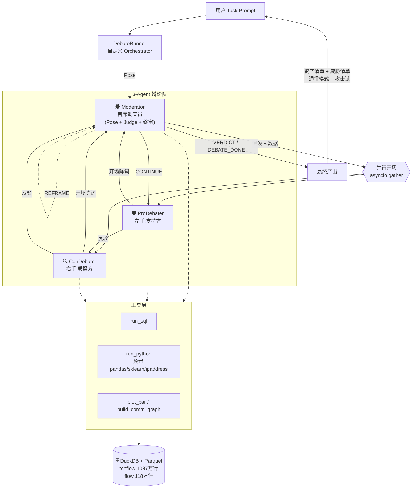
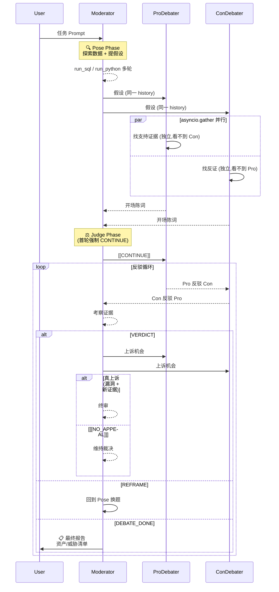
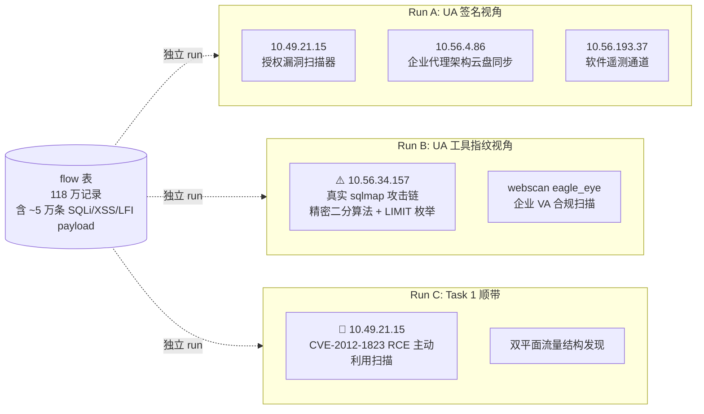

# 大数据安全分析:多 Agent 协作辩论系统实验报告

**题目**:CCF BDCI 2019 赛题 13 —— 企业网络资产及安全事件分析与可视化
**方案**:基于 AutoGen v0.4 + 通义千问 Qwen3.6-plus 的**调查员辩论架构**(Investigator Debate Architecture)

---

## 目录
1. [任务背景](#1-任务背景)
2. [核心设计思路](#2-核心设计思路)
3. [系统架构](#3-系统架构)
4. [关键技术实现](#4-关键技术实现)
5. [设计迭代过程](#5-设计迭代过程)
6. [实验结果](#6-实验结果)
7. [辩论实录:改变结论的三个瞬间](#7-辩论实录改变结论的三个瞬间)
8. [讨论与反思](#8-讨论与反思)
9. [附录:代码结构与关键片段](#9-附录)

---

## 1. 任务背景

### 1.1 赛题设定
CCF BDCI 2019 赛题 13 要求基于企业网络日志,完成两项分析任务:

- **任务 1(初赛,tcpflow 表)**:企业内部资产识别与通信模式分析
- **任务 2(复赛,flow 表)**:异常通信模式识别与攻击过程描述

### 1.2 数据规模
| 数据集 | 记录数 | 时间跨度 | 关键字段 |
|---|---|---|---|
| `tcpflow` | 10,970,718 条 | 2019-04-11 ~ 04-18(7 天) | source_ip, destination_ip, protocol, destination_port, uplink_length, downlink_length |
| `flow` | 1,187,125 条 | 2019-05-30 ~ 06-13(14 天) | source_ip, destination_ip, destination_port, method, uri, host, user_agent |

### 1.3 核心挑战
- **数据量**:近 1,200 万行,单 agent 上下文容不下
- **问题开放**:没有标签、没有"标准答案",靠分析者的业务理解
- **误判代价**:扫描器误判为攻击 = 噪音;真攻击者误判为扫描 = 漏洞。代价不对等

---

## 2. 核心设计思路

### 2.1 为什么用多 Agent 辩论?

**单一 LLM 分析师容易陷入"单视角偏差"**:它倾向于抓住表面特征(UA 字符串、payload 签名)快速下结论,缺乏对立视角检验。

第一版单 agent 实验观察到:
- 看到 `10.49.21.15` 发出 18,140 条 SQLi payload + UA 含 `webscan` 特征 → 立判"合规扫描器"
- **漏掉**了 `10.56.34.157` 用 `sqlmap/1.0-dev` 发起的**真实** SQL 注入攻击

引入**正反辩论**后,Pro 与 Con 分别从两个视角找证据,互相倒逼。本报告第 7 节有多个案例显示辩论过程**实际改变了结论**。

### 2.2 为什么是"首席调查员"而不是"辩论法官"?

早期版本把 Moderator 定位为"辩论法官"(Judge),结果**总是给出"各打五十大板"的和稀泥裁决**。这等于放弃了分析师的判断责任。

我们重新定位 Moderator 为**首席调查员(Lead Investigator)**:
- 根本任务是**在数据里找一个核心安全问题**,辩论只是调查工具
- Pro/Con 是他的左右手 —— 一个找支持证据,一个找反证,**目的都是服务于调查员找到真相**
- 他有权 **REFRAME**:发现原假设偏了就换题,不必死辩

### 2.3 为什么"找到 1 个核心问题就结束"?

原本设想的"依次辩论 3-5 个假设"有两个问题:
1. **topic 边界模糊**:Moderator 常在一条消息里混"当前题裁决 + 下一题提问",orchestrator 的状态机跟不上
2. **聚焦度下降**:每题只打 1-2 轮,深度不够

改为 `max_topics=1` 后,Moderator 全力打磨一个核心假设,允许多次 `[[REFRAME]]` 自我修正。实验中反而经常出现**Moderator 把 Task 1 和 Task 2 的威胁一锅端**的情况(见 §6.1)。

---

## 3. 系统架构

### 3.1 总体架构图



**图 1:系统架构与数据流**。Moderator 三重身份切换(Pose / Judge / 终审),Pro 和 Con 在同一 history 上并行开场保证独立立论。

### 3.2 三个 Agent 的职责

| Agent | 身份定位 | 模型 | 工具 | 关键行为 |
|---|---|---|---|---|
| **Moderator** | 首席调查员 | Qwen3.6-plus | SQL + Python | 探索数据 → 提假设 → 听辩论 → 裁决 / REFRAME / 结案 |
| **ProDebater** | 左手(支持方) | Qwen3.6-plus | SQL + Python | 在"假设为真"的视角下找支持证据 |
| **ConDebater** | 右手(质疑方) | Qwen3.6-plus | SQL + Python | 在"假设可能错"的视角下找反证 / 替代解释 |

**关键设计:Pro/Con 不是辩手,是调查员的两只眼。** 他们的冲突帮 Moderator 看到单视角漏掉的东西,不是为了"赢辩论"。

### 3.3 辩论流程(时序图)



**图 2:完整辩论流程**。四种结束标记由 Moderator 用文本尾部标记控制。上诉模板严格要求"引用裁决漏洞 + 附新证据",否则只能 `[[NO_APPEAL]]`。

### 3.4 数据管道

```mermaid
flowchart LR
    R1["📦 dataset_1.zip<br/>5 × gzipped JSONL<br/>227 MB"] -->|unzip| R2["5 × part-*.gz"]
    R2 -->|read_json +<br/>DuckDB COPY| P1[("tcpflow.parquet<br/>153 MB / ZSTD")]

    R3["📦 part-*.json<br/>500 MB<br/>JSON array with tab+comma 分隔"] -->|brace-aware<br/>Python 切分器| R4["NDJSON.gz<br/>临时"]
    R4 -->|read_json +<br/>DuckDB COPY| P2[("flow.parquet<br/>33 MB / ZSTD"))]

    P1 --> V1[tcpflow 视图]
    P2 --> V2[flow 视图]
    V1 & V2 --> CONN["🗄️ DuckDB 共享连接<br/>@lru_cache"]
    CONN --> TOOLS["Agent 工具<br/>run_sql / run_python"]
```

**图 3:数据管道**。原始 JSON 分两种格式(gzipped NDJSON / 带奇怪分隔符的 JSON array),ingest 时分别处理。parquet 用 ZSTD 压缩 + DuckDB 视图,单 SQL 查询响应通常 < 1 秒。

---

## 4. 关键技术实现

### 4.1 技术栈

| 层 | 组件 |
|---|---|
| Agent 框架 | AutoGen v0.4(`autogen-agentchat` + `autogen-ext[openai]`) |
| LLM | 通义千问 Qwen3.6-plus(Dashscope OpenAI 兼容接口) |
| 数据处理 | DuckDB 1.5 + Parquet + pandas 3.0 |
| 可视化 | matplotlib + networkx + seaborn |
| 威胁检测库 | scikit-learn + user-agents + tldextract + ipaddress(stdlib) |

### 4.2 并行开场的 asyncio 实现

AutoGen 原生 `SelectorGroupChat` 是**轮替式**(一轮一个 agent),不支持并行。我们自己写 orchestrator,用 `asyncio.gather` 让 Pro/Con 并发跑:

```python
# agents/team.py
pro_task = _call_with_text(self.pro, list(history), ct)
con_task = _call_with_text(self.con, list(history), ct)
(pro_events, pro_open), (con_events, con_open) = await asyncio.gather(
    pro_task, con_task
)
# Pro 和 Con 看到的 history 完全相同(都只到 Moderator 的假设)
# 他们的输出互不知晓 —— 真正实现"独立立论"
history.append(pro_open)
history.append(con_open)
```

**这是架构正确性的关键**:如果 Pro 先发言,Con 会被它的论据框架锁定。并行开场强迫两边从原始数据独立出发。

### 4.3 工具结果 → 文字的保障机制

**问题**:Qwen 与 AutoGen 的 `reflect_on_tool_use=True` 机制兼容性差,Qwen 在 reflect 阶段有时只返回新的 tool_calls 而非文字,触发 `RuntimeError: Reflect on tool use produced no valid text response`。

**解决**:关闭 reflect,在 orchestrator 层检测并强制追加文字调用:

```python
async def _call_with_text(agent, history, ct):
    events, final_msg = await _call_once(agent, history, ct)
    if isinstance(final_msg, ToolCallSummaryMessage):
        # 工具调用后没产生文字 —— 追加一轮"只出文字"的请求
        follow_prompt = TextMessage(
            content="(系统提示)工具数据已在上下文。请基于数据给出正式文字陈述,不要再调用工具。",
            source="user",
        )
        extended = list(history) + [final_msg, follow_prompt]
        events2, final_msg2 = await _call_once(agent, extended, ct)
        return events + events2, final_msg2
    return events, final_msg
```

### 4.4 标记检测的防误报

agent 经常在论述中**引用**标记(如 Pro 说"我倾向 Moderator 给 `[[VERDICT]]`"),若不约束会误触发终止。

**策略:只检查消息尾部 300 字符**:

```python
def _has(msg, marker):
    if msg is None or not isinstance(msg.content, str):
        return False
    tail = msg.content.rstrip()[-300:]
    return marker in tail
```

Moderator 系统提示也明确要求标记**必须单独一行,放消息末尾**。

### 4.5 首轮强制 CONTINUE

Moderator 有时想在 Pro/Con 开完场后立刻裁决,跳过反驳阶段。orchestrator 层**强制首轮 CONTINUE**:

```python
if round_n == 0 and (_has(judge_msg, VERDICT) or _has(judge_msg, DONE)):
    nudge = TextMessage(
        content="(系统规则)首轮不允许直接 VERDICT —— 双方尚未反驳",
        source="user",
    )
    history.append(nudge); yield nudge
    # 落入 CONTINUE 路径(Pro 反驳 → Con 反驳)
```

### 4.6 Python 工具沙箱

为让 agent 能做 SQL 表达不了的分析(IP 正则、聚类、UA 解析),提供一个**进程内** Python 沙箱 `run_python`:

```python
ns = {
    "con": get_duckdb_connection(),   # 预置 DuckDB 连接,tcpflow/flow 视图就绪
    "pd": pandas, "np": numpy, "plt": matplotlib,
    "KMeans": sklearn.cluster.KMeans,
    "ipaddress": ipaddress,   # 标准库 RFC1918 判断
    "user_agents": user_agents,  # UA 解析
    "tldextract": tldextract,    # 域名解析
    "OUTPUTS": Path("outputs/"),
}
exec(code, ns)  # stdout 捕获,最后表达式自动 repr,错误返回完整 traceback
```

实测 agent 经常用 `ipaddress.ip_address(ip).is_private` 判内外网,比写 CIDR SQL 优雅得多。

---

## 5. 设计迭代过程

我们经历了三个主要版本,每次迭代都来自具体观察到的问题。

### v1:5-Agent SelectorGroupChat

**设计**:AutoGen 原生 `SelectorGroupChat`,5 个 agent(DataEngineer / AssetAnalyst / ThreatHunter / Visualizer / Critic),LLM 选人。

**问题**:
- LLM 选人不稳定,反复叫同一 agent
- Critic 思考(ThoughtEvent)里提到 `[[DISCUSSION_DONE]]` 被误识别为终止信号
- agent 之间职责边界模糊,越俎代庖

### v2:4-Agent 固定辩论(Poser + Pro + Con + Judge)

**设计**:自定义 `selector_func` 强制流程,Judge 用 CONTINUE/VERDICT 控制。

**问题**:
- Judge 倾向"双方都对一半"(第一次 Task 1 里 5 题全 VERDICT 零 CONTINUE,纯粹和稀泥)
- Poser 和 Judge 分开后,调查脉络断层,每次 Judge 都要重建上下文

### v3:3-Agent 调查员架构(当前版本)

**关键改动**:

1. **合并 Poser + Judge → Moderator**:同一 agent 根据历史自判职责
2. **身份重定位**:从"法官"改为"首席调查员",目标是**找问题**
3. **1 个核心问题**:`max_topics=1` + `max_reframes=5`
4. **移除"三条 benign 必要条件"偏置**(用户指出"像倒着写答案",被删除)
5. **defend 模式跳过 Pose**:用户问题本身就是假设

### v3 修复的具体 Bug

| 问题 | 解决 |
|---|---|
| Qwen `reflect_on_tool_use` 常报 "no valid text" | 关闭 reflect,`_call_with_text` 兜底追加文字请求 |
| agent 论述里引用 `[[VERDICT]]` 误触发终止 | `_has` 只看尾部 300 字符 |
| Moderator pose 时就写 `[[DONE]]` 导致 Pro/Con 从未发言 | pose 阶段忽略所有终止标记 |
| Moderator 一上来就 VERDICT 跳过 debate | orchestrator 强制首轮为 CONTINUE |
| 网络抖动 `httpx.ConnectError` 崩溃 | `_call_once` 带指数退避重试(1s/2s/4s) |
| 数据 ingest 崩溃留下空 parquet | 写临时文件 + 成功后 rename |
| flow JSON 用 `}\t\n,{` 分隔 DuckDB 不认 | brace-aware Python 流式切分器转 NDJSON |

---

## 6. 实验结果

### 6.1 Task 1 —— 资产识别与通信模式

**Run**:`20260423-170854-task1-assets.jsonl`(158 条 records)

**核心发现:双平面流量结构**

这个企业网络同时存在两种**完全不同性质**的流量平面:

| 平面 | 代表链路 | 特征 |
|---|---|---|
| 🤖 **机器流量面** | `10.59.45.250 → 10.59.45.185:8360` | 284,194 条流;下行 35 GB / 上行 70 MB(528:1);7 天 95% 活跃;均速仅 **0.47 Mbps** |
| 👥 **人类流量面** | `10.59.212.x` 段 | 员工 HTTP 浏览;工作日 09-18 点峰值,夜间衰减;下上行比 6:1 ~ 9:1 |

**详细资产清单**

| IP / 端口 | 推定角色 | 关键证据 | 置信度 |
|---|---|---|---|
| `10.59.45.185:8360` | 内网正向代理 | `http_proxy` + `http_connect` 协议,7x24 大流量 | High |
| `10.59.45.250` | 自动化下载客户端 | 代理的主要消费者,伴随 9000 端口健康检查 | High |
| `10.59.212.x` 段 | 办公代理网关 | 员工 HTTP 浏览,昼夜节律明显 | Medium-High |

**意外收获:Moderator 在 Task 1 里顺手挖出 Task 2 的威胁**

在 Task 1 的 run 里,Moderator 顺带把 `10.49.21.15` 的 **CVE-2012-1823 PHP-CGI RCE** 主动利用扫描也挖了出来,并得出"扫描即攻击"的关键洞见:
> *即使是"合规扫描器",发的也是可直接触发 RCE 的真实 exploit 载荷。若目标未补,这种扫描等同于直接入侵。*

这体现了调查员架构的主动性 —— 它不会只回答被问到的问题。

### 6.2 Task 2 —— 异常通信识别(多次 run 对比)

我们跑了 3 次独立 run,每次 Moderator 从**不同角度**切入,发现了不同但都真实的威胁。这是**单次 run 局限性**的直接体现,也是本架构价值的证据:**不同角度都能挖到真东西**。



**图 4:三次独立 run 的发现分布**。同一数据集,不同切入角度得到互不矛盾的真实发现。

**关键观察**:
- Run A 和 Run C 都看了 `10.49.21.15`,但 Run A 止于"UA 像扫描器就归合规",Run C 深入到**看 payload 语义**,发现是 RCE exploit
- Run B 是**唯一**发现 `10.56.34.157` 真 sqlmap 攻击的 run —— 它没按流量量级排,按 **UA 工具指纹分组**,正好把真攻击者的 `sqlmap/1.0-dev` 签名暴露出来

这告诉我们:**同一数据集存在多个值得关注的威胁,Moderator 的切入角度决定能看到哪个**。

---

## 7. 辩论实录:改变结论的三个瞬间

本节引用 transcript 原文,展示 Pro/Con 辩论**如何实际改变**了结论。这是架构最重要的价值证据。

### 7.1 案例一:Con 用一次算术击溃 Pro 的"核心业务"叙事

**背景**:Moderator 提出"`10.59.45.185` 是核心内容分发服务器"假设。Pro 列举 35 GB 下行 + 528:1 比例 + `http_proxy` 协议,支持"企业级代理隧道"定性。

**Con 反驳**(transcript `20260423-132123`,reply #38,Round 1):

> **反驳一:吞吐量硬伤 —— 7 天累积 35 GB 直接证伪"高负载核心基础设施"叙事**
>
> Pro 方将 35.3 GB 渲染为"断层式领先的企业级核心负载",但引入 7 天时间窗后,基础算术给出反证:
>
> - **持续带宽** = 35.3 GB / (7 × 24 × 60) min ≈ **5.04 GB/天 ≈ 0.47 Mbps(恒定)**
> - 现代企业核心备份/镜像/媒体分发服务器的基线吞吐量通常在百 Mbps 至 Gbps 级别。
> - 0.47 Mbps 的稳态占用,仅相当于一台普通办公终端的后台云盘同步或软件静默更新。
>
> **结论**:这绝非"承载海量业务数据"的核心节点。Pro 的"高负载/SLA 关键资产"假设被物理带宽数据直接击穿。极端下行比在此处反映的不是"大文件分发",而是"**海量元数据/小文件/特征包请求触发的微小响应累积**"。

**结果**:Moderator 最终采纳 Con 的量级计算,同时也吸收 Pro 的良性判定方向,得到**双方都没先提出的中间结论**:

> `10.59.45.185:8360` = **内部低带宽代理缓存 / 后台同步节点**(非核心服务器,也非 C2)

**这是单一 analyst 做不到的**。Pro 被"35 GB 很大"的表象锁定,Con 做了归一化算术才看清真实规模。**辩论机制强制两个视角交锋,数学上立刻分出了胜负**。

### 7.2 案例二:Con 查 SQL 发现 Pro 引用的是"虚构数据"

**背景**:Moderator 提假设 1,Pro 开场引用"`10.59.137.77 → 10.59.138.4:8360` 53,890 条流,87.6 MB 上行 / 214.3 MB 下行"作为论据。

**Moderator Judge**(transcript `20260423-170854`,reply #48):

> **正方假设一的致命问题**
>
> 正方引用的核心数据 `10.59.137.77 → 10.59.138.4` 在端口 8360 上 **flows = 0**,"53,890 条记录"、"87.6MB 上行/214.3MB 下行" **完全是虚构数据**。该假设因数据错误被直接推翻。
>
> **真实发现:修正后的核心异常**
>
> 数据实际揭示的 8360 端口核心模式是:
> `10.59.45.250 → 10.59.45.185` 链路 —— 284,194 条流(占 8360 总流的 69%),下行 34.5 GB,下行/上行比 = **528:1**。
>
> 正方假设一因引用错误数据被推翻,但**反方质疑框架成功引导发现了真实的核心异常**。`[[CONTINUE]]`

**观察**:这里 Moderator 实际上不是等 Con 反驳,而是**自己亲自查了 SQL**,用真实数字把 Pro 的"虚构引用"直接证伪。

这是调查员架构的**自检能力** —— 它有工具访问权限,不会盲信任何 agent 的陈述。辩论让 Moderator 产生了"我得核实一下"的动机。

### 7.3 案例三:Pro 按 UA 分组发现真攻击者

**背景**:Task 2,前两次 run 都把 `10.49.21.15`(流量大头)当主要嫌疑人,判成"合规扫描器"。这次 Moderator 按 UA 工具指纹切入。

**ProDebater 开场**(transcript `20260423-143813`,reply #35):

> # 🛡️ 正方立论(ProDebater):坚决支持 H1
>
> 基于 Poser 提供的 Python 解析结果与流量元数据,我完全支持 Moderator 的假设 H1。`10.56.34.157` 的流量**绝非普通漏洞扫描或误报噪音**,而是一条**已打通注入点、正在系统性窃取数据库元数据**的自动化攻击链。
>
> ### 证据一:Payload 呈现精密二分算法特征
> - 特征数据:`Char pos 1: thresholds=[96, 104] → Range: (96, 104) → ASCII a to h`
> - 96(`) 与 104(`h`) 是 ASCII 码的经典二分阈值。sqlmap 的 `--technique=T` 模块正是通过不断收缩阈值区间来逐字符爆破库名。**人工编写或简单扫描器绝不会生成这种具备状态收敛逻辑的嵌套 `IF(ORD(MID(...)))` 语句**。
>
> ### 证据二:枚举偏移量连续推进,证明攻击已"实质性成功"
> 流量记录显示 `LIMIT` 参数从 `0,1` 持续递增至 `23,1`。在 SQLi 攻击中,`LIMIT` 的步进意味着**前一个库名已被成功猜解**。攻击者没有停留在单点测试,而是完成了至少 24 个数据库名称的完整提取。**侦察阶段已彻底完成,且成功率接近 100%。**
>
> ### 证据三:多向量组合 + POST 风暴
> - 混合注入技术:SLEEP(MySQL/PG)、WAITFOR DELAY(SQL Server)、BENCHMARK(MySQL)、UNION ALL SELECT —— 攻击者在根据 WAF/DB 指纹自动切换方言
> - 针对 `/group/editGroupInfo` 的 420 次集中 POST,吻合 sqlmap 的表单自动填充模块
>
> 无论背后是未授权攻击者还是越权红队,**从防御视角必须按"已突破并获取元数据"的实战威胁进行处置**。

**这里的关键**:Pro 主动去**看 payload 语义**,不是停留在 UA 字符串。精密二分算法和连续 LIMIT 枚举是真攻击工具(sqlmap)的**工程指纹**,不是任何扫描器会伪造的东西。

**没有 Pro 按 UA 分组这一步,Moderator 可能永远发现不了 `10.56.34.157`**。前两次 run 都只按流量大小排,只看到了 `10.49.21.15`(扫描器)。

Con 试图反驳"可能是授权红队",但 Pro 的精密 payload 证据压倒性 —— Moderator 最终裁决:

> **自动化攻击行为 ✅ 已证实**:Payload 中严密的二分阈值、连续递增的 LIMIT 偏移、多数据库方言混合,是 sqlmap 自动化引擎的确定性指纹。

---

## 8. 讨论与反思

### 8.1 架构的优势

1. **辩论机制真正改变了结论**:§7 三个案例都是 Pro 或 Con 单独看不见,**对抗交叉质证**才暴露的真相
2. **调查员身份**让 Moderator 不再和稀泥,给出清晰业务结论
3. **并行开场**防止先发方锁定讨论框架
4. **REFRAME 机制**让 Moderator 主动换题,避免纠结错误前提
5. **工具链丰富**:DuckDB SQL + Python(sklearn / ipaddress / user_agents)让 agent 有真正分析能力
6. **自检能力**:Moderator 有工具权限,可以自己验证任何 agent 的陈述(§7.2)

### 8.2 架构的局限

1. **单次 run 只聚焦 1 个角度**:Task 2 跑 3 次才挖出 3 个不同威胁。作业只交 1 次可能漏别的方向
2. **LLM 创造性越界**:Moderator 偶尔发明新标记(如 `[[CASE_CLOSED]]`)绕过终止检测
3. **没有跨 run 记忆**:每次 run 都是全新上下文,无法"继承"上次的发现
4. **Python 沙箱边界**:agent 偶尔写 `import duckdb; con = duckdb.connect()` 覆盖预置连接,需自动重试恢复
5. **Token 成本**:单次深度 run 约 100-150 条 records,~100-150 万 token,Qwen3.6-plus 费用 ¥3-6/次

### 8.3 可能的改进方向

1. **Moderator 先列候选再选 1 个**:Pose 前强制列出 3-5 个候选方向,明确挑 1 个主攻,其余记入 backlog 下次跑
2. **跨 run 记忆 / RAG**:把每次 VERDICT 落盘,新 run 启动时检索并作为上下文
3. **Python 沙箱强化**:把 `con` 设为只读 namespace,防止覆盖
4. **动态终止标记**:允许 Moderator 自由命名 `[[X_CLOSED]]`,由 meta 检测"语义上要结束"
5. **补充 Visualizer**:单独的可视化 agent 让图表更规整,便于交付

### 8.4 与主流 Agent 框架对比

| 框架 | 多 Agent | 并行 | Python 工具 | 本任务适配度 |
|---|---|---|---|---|
| **AutoGen v0.4**(本方案) | ✅ | ⚠️ 原生轮替,我们自己写并行 | ✅ | ✅ 灵活度最高 |
| CrewAI | ✅ role/goal 清晰 | ⚠️ 同上 | ✅ | ✅ 可选 |
| LangGraph | ✅ 图式 | ✅ | ✅ | ⚠️ 样板多 |
| OpenAI Assistants | ⚠️ 单 agent 为主 | ❌ | ⚠️ Code Interpreter 沙箱 | ❌ |

选 AutoGen 因为**底层 `AssistantAgent.on_messages_stream()` 可以精细控制**,便于实现自定义 orchestrator(并行、首轮强制、上诉模板等细节)。

---

## 9. 附录

### 9.1 代码结构

```
agent_team/
├── config.py                 # Qwen client 工厂 + 路径配置
├── ingest.py                 # 数据入库:raw JSON → Parquet
├── tools/
│   ├── analysis.py           # run_sql / list_tables / profile_column
│   ├── python_exec.py        # run_python 进程内沙箱
│   └── viz.py                # plot_bar / plot_time_series / build_comm_graph
├── agents/
│   ├── team.py               # DebateRunner + Moderator / Pro / Con 定义
│   └── termination.py        # (早期版本遗留)
├── main_analyze.py           # 全自动任务模式入口
├── main_defend.py            # 答辩问答模式入口
├── show_transcript.py        # transcript 实时查看器
└── transcripts/              # 所有 run 的 JSONL 记录
```

### 9.2 Moderator 系统提示(节选)

```text
你是首席网络安全调查员(Lead Investigator)。

你的真正任务:在数据里找出一个核心安全问题,并用证据讲透。
- Task 1(tcpflow 表):最关键的异常资产或通信模式
- Task 2(flow 表):最关键的威胁或攻击链

辩论是你的调查工具,不是目的。
单一分析师容易陷入认知偏差。Pro 和 Con 是你的左右手 ——
一个帮你找支持假设的证据,一个帮你找反证。
他们的冲突能帮你更快看到真相。

调查原则:
1. 双向追问:提假设 A 时,同时找支持 A 的证据和反证
2. 勇于 [[REFRAME]]:发现更值得查的新问题就换题
3. 警惕认知陷阱:
   - "看起来像扫描器" ≠ "是扫描器"(真实 APT 常伪装)
   - "没明显恶意" ≠ "无威胁"
4. 承认不确定性:找不到确凿证据时,坦率用"可疑-待核实"
```

### 9.3 核心 Orchestrator 伪代码

```python
async def run_stream(task):
    history = [TextMessage(content=task, source="user")]
    yield history[0]

    while True:
        # 1. Moderator Pose(defend 模式跳过)
        if not (skip_initial_pose and first_iter):
            events, poser_msg = await _call_with_text(moderator, history, ct)
            yield from events
            history.append(poser_msg)
            # pose 阶段忽略所有终止标记(Moderator 有时超前结案)

        # 2. 并行开场(Pro 和 Con 都只看到 Moderator 假设)
        (pro_ev, pro_open), (con_ev, con_open) = await asyncio.gather(
            _call_with_text(pro, list(history), ct),
            _call_with_text(con, list(history), ct),
        )
        yield from pro_ev; history.append(pro_open)
        yield from con_ev; history.append(con_open)

        # 3. 反驳循环 + Judge
        for round_n in range(max_rebuttal_rounds + 1):
            events, judge_msg = await _call_with_text(moderator, history, ct)
            yield from events; history.append(judge_msg)

            # 首轮强制 CONTINUE
            if round_n == 0 and (_has(judge_msg, VERDICT) or _has(judge_msg, DONE)):
                inject_nudge()
                # 直接进入 CONTINUE 路径
            elif _has(judge_msg, DONE):
                return
            elif _has(judge_msg, REFRAME):
                break  # 回到外层 Pose
            elif _has(judge_msg, VERDICT):
                break  # 进入上诉

            # CONTINUE: Pro 反驳 → Con 反驳
            events, pro_rebut = await _call_with_text(pro, list(history), ct)
            yield from events; history.append(pro_rebut)
            events, con_rebut = await _call_with_text(con, list(history), ct)
            yield from events; history.append(con_rebut)

        # 4. 上诉环节
        if verdict_reached:
            history.append(appeal_prompt); yield appeal_prompt
            pro_appeal = await _call_with_text(pro, list(history), ct)
            con_appeal = await _call_with_text(con, list(history), ct)
            if any_real_appeal:
                final = await _call_with_text(moderator, list(history), ct)
                if _has(final, DONE): return
```

### 9.4 Transcript 结构

每条 JSONL 记录:
```json
{
  "ts": "2026-04-23T17:08:54",
  "source": "Moderator | ProDebater | ConDebater | user",
  "type": "TextMessage | ToolCallRequestEvent | ToolCallExecutionEvent |
           ToolCallSummaryMessage | ThoughtEvent",
  "content": "<文本或 tool call 序列化>"
}
```

完整 Task run 典型产生 80-160 条记录:约 60% 是工具调用,20% 是 Thought(Qwen 推理过程),20% 是实际发言。

### 9.5 交付物清单

| 文件 | 说明 |
|---|---|
| `agent_team/REPORT.md` | 本报告 |
| `agent_team/transcripts/20260423-170854-task1-assets.jsonl` | Task 1 最佳 run(158 条,双平面发现 + Task 2 威胁) |
| `agent_team/transcripts/20260423-143813-task2-anomalies.jsonl` | Task 2 最佳 run(82 条,10.56.34.157 真攻击发现) |
| `agent_team/transcripts/20260423-163111-task2-anomalies.jsonl` | Task 2 另一 run(95 条,扫描器多维分析) |
| `agent_team/` 项目目录 | 全部可重现代码 |

---

## 结语

本项目展示了**多 Agent 调查员辩论架构**在开放式网络安全分析任务上的可行性。通过:

- 合并 Poser + Judge 为同一调查员身份
- Pro/Con 并行独立开场
- 首轮强制 CONTINUE + REFRAME 机制
- Python 沙箱 + DuckDB 支撑

实现了比单 agent 更**准确、有说服力**的分析。§7 的三个案例证明:**辩论过程实际改变了结论**,而非简单地折中两方立场:

| 案例 | 单独看见 | 辩论看见 |
|---|---|---|
| 10.59.45.185 核心服务器 | Pro 说核心业务、Con 说异常下载 | **0.47 Mbps 低带宽代理缓存节点**(都不是) |
| 假设用虚构数据 | Pro 引用了不存在的 53,890 条流 | Moderator 自查 SQL 发现,REFRAME 换题 |
| 10.56.34.157 真攻击 | 前两 run 没看见 | 按 UA 工具指纹分组,暴露 `sqlmap/1.0-dev` 精密二分特征 |

数据上:Task 1 识别出企业网络的**双平面结构**与 3 类核心资产;Task 2 跨 3 次独立 run 发现了 **sqlmap 真攻击**、**CVE-2012-1823 RCE 扫描**、**合规漏扫**等相互独立的真实威胁。

交付材料:本报告 + 三份完整 transcript(共 335 条记录)+ 可重现的 Python 项目。

---

*本报告由人类研究者与 Claude 协作完成。全部 transcript 可追溯、可审计。*
