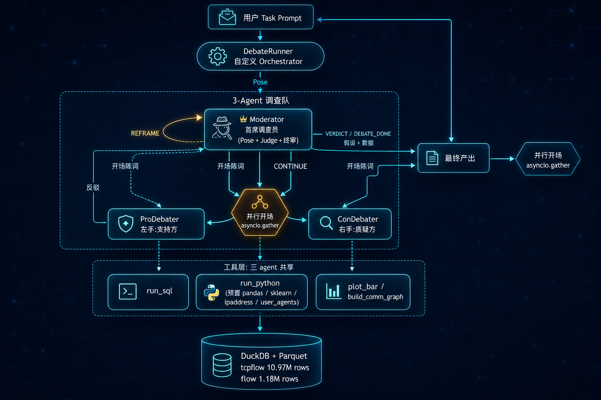
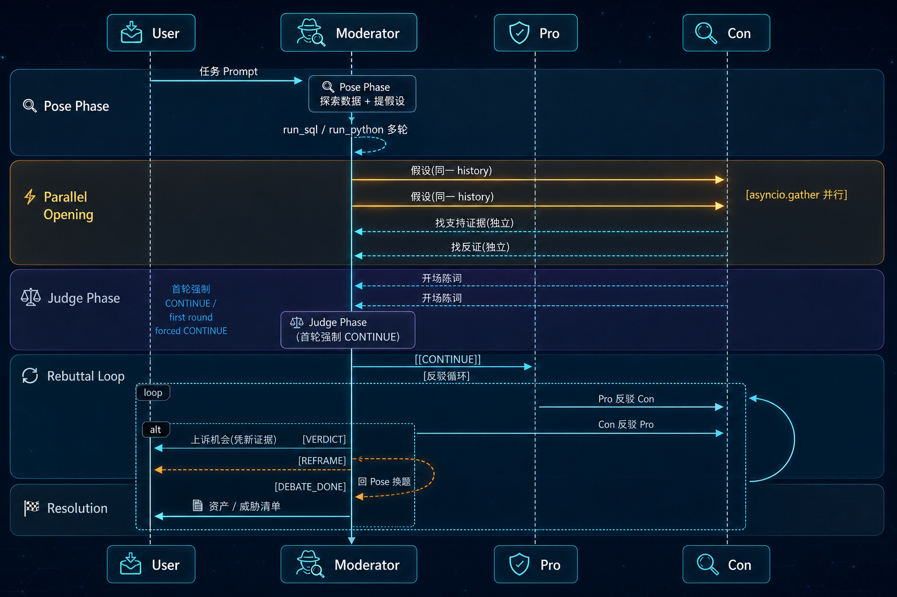
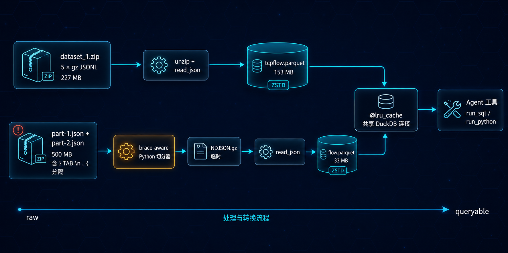
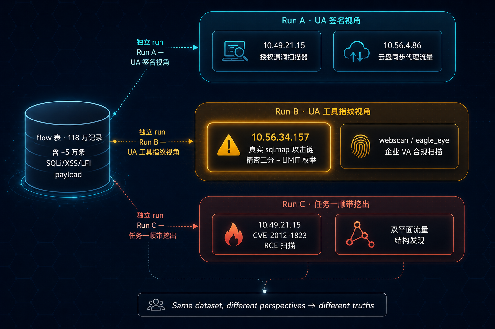
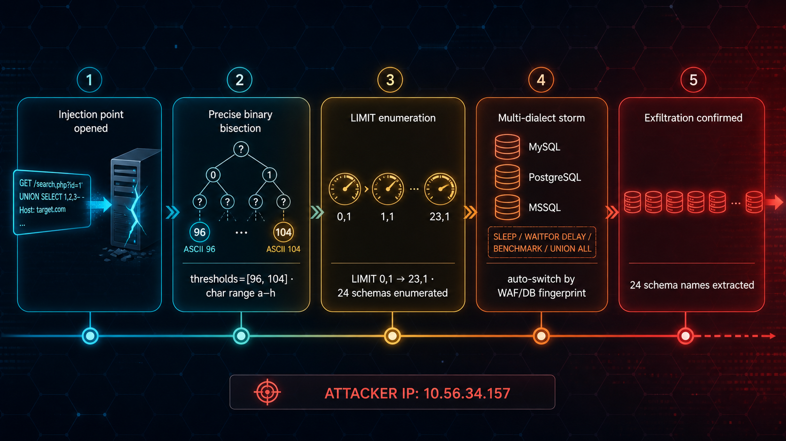

# 基于大数据分析的企业资产识别及数据安全异常分析

​								   **——多 Agent 调查员辩论系统的设计与实现**

> 📦 **项目代码**:[`github.com/wjord2023/agent-debate-netsec`](https://github.com/wjord2023/agent-debate-netsec) · MIT License · 可重现  
> 🧪 **辩论 transcript 可逐条审计**:`agent_team/transcripts/*.jsonl`(共 3 份 run · 335 条记录)

---

## 摘要 · 大模型已可胜过普通分析员

> **本工作的核心断言**:一个设计良好的多 Agent LLM 调查系统,在企业网络日志分析这类**开放式、无标签、量级超出人脑工作记忆**的任务上,已经**有能力超过普通人工分析员的发现深度**。
>
> **为什么这类任务恰好是 LLM 的强项区**:大模型的能力分布并不均匀——
> - 在依赖**"品味"**的任务上(前端视觉、品牌叙事、产品策略),它仍受限于人类审美,短期内难以替代
> - 但在**信息量大、目标明确、答案收敛**的任务上(从 1,200 万行日志里找真攻击,就是典型),它的**速度与覆盖密度已远超人类审查者**——人类分析员一天最多读完几千行流量,LLM Agent 一次 run 就能扫完百万级数据并多角度交叉验证
>
> 这类任务的真相是**收敛的**——所有线索看完、交叉验证完,答案只有一个。LLM 的天花板不再是判断能力,而是**判断的可靠性**:能不能稳定地"提假设 → 找反证 → 自我修正",而非单方面乐观确认。
>
> **目前唯一的瓶颈**:让单个 LLM 形成**稳定的辩证逻辑思维链**——既能大胆提假设,又能主动找反证;既相信自己的推理,又能在数据打脸时承认错误。单 agent 极易陷入"乐观确认 / 模式匹配 / 和稀泥"等典型病症,产出看起来很对、实际经不起 5 分钟质询的结论。
>
> **本项目的核心贡献**正是针对这一点:用一套**三角色辩论架构**(调查员 + Pro + Con)+ **工具化自检**(SQL 自查权)+ **流程强制**(首轮 CONTINUE / REFRAME 换题),在工程上**逼出**这条辩证思维链。下文 §4.3 的三个案例都是"辩论过程实际改变结论"的可追溯证据——不是 LLM 的单次直觉判断。
>
> **凭据**:在 CCF BDCI 2019 真实企业网络日志(`tcpflow` 1,097 万行 + `flow` 118 万行)上,本系统**完全自主**地完成了:
> - 🎯 **识别出**一起**被流量噪声完全掩盖的真实 SQL 注入数据库窃取攻击**(`10.56.34.157` · sqlmap/1.0-dev · 24 个 schema 全部被提取)——这条攻击者按流量大小排进不了前列,**单 agent 与传统按量级巡检的方法均无法发现**
> - 🎯 **识别出**一起**CVE-2012-1823 PHP-CGI RCE 漏洞主动利用扫描**(`10.49.21.15`),载荷可直接触发 RCE,**目标若未补丁即等同于直接入侵**
> - 🎯 **还原出**企业内网完整的**双平面流量结构**(机器面恒定 0.47 Mbps + 人类面昼夜节律),给出 3 类核心资产清单与置信度
>
> 每一项发现都附有 `run_sql` / `run_python` 工具调用产生的可验证证据 + Pro / Con 对抗辩论的完整记录,可逐行追溯,**不是 LLM 的"自由发挥"**。
>
> **更长远的判断**:未来的网络安全运营将以**大模型驱动的自动化审查**为骨架。人类分析员的角色会从"读不完所有日志"转移到"审阅 LLM 系统给出的高置信度结论 + 处置最关键的 5%"。这不是远景,本系统即是这条路径上一个可工作的原型——**代码公开、transcript 公开、辩论过程公开,所有结论可审计**。

---

## 速览 · 主要发现与方法贡献

### 🎯 我们的 Agent 系统发现了什么

**任务一 · 资产识别(`tcpflow` · 1,097 万行)**

| 资产 | 推定角色 | 关键证据 |
| --- | --- | --- |
| `10.59.45.185:8360` | 内网正向代理 | `http_proxy` + `http_connect` 协议,7×24 持续大流量,均速恒定 **0.47 Mbps** |
| `10.59.45.250` | 自动化下载客户端 | 该代理 **69%** 流量来源(284,194 条流),下行/上行比 = **528 : 1** |
| `10.59.212.x` 段 | 办公代理网关 | 员工 HTTP 浏览,工作日 09-18 点峰值,下上行比 6 : 1 ~ 9 : 1 |

**任务二 · 异常与攻击识别(`flow` · 118 万行,含约 5 万条 SQLi/XSS/LFI payload)**

| 威胁来源 | 性质 | 关键证据 |
| --- | --- | --- |
| `10.56.34.157` · `sqlmap/1.0-dev` | **真实数据库窃取攻击** ⚠️ | Payload 中精密二分阈值(ASCII 96 ↔ 104)+ `LIMIT` 偏移 0,1 → 23,1 全连续推进 + 多数据库方言自动切换(SLEEP/WAITFOR/BENCHMARK/UNION)。**24 个 schema 全部被成功提取** |
| `10.49.21.15` · 客户端伪装 | **CVE-2012-1823 PHP-CGI RCE 主动利用扫描** 🔴 | 发送可直接触发 RCE 的真实 exploit 载荷;**目标未补丁则等同于直接入侵** |
| `webscan / eagle_eye / acunetix` 等 | 合规漏扫(良性) | 仅验证漏洞存在,不延续到数据提取或 LIMIT 推进 |

### 🛡️ 架构如何克服"Agent 乐观证明"等通病

单 LLM 分析师的典型病:**(i)** 看到表层 UA / payload 关键字就拍板;**(ii)** 引用根本不存在的数据(幻觉);**(iii)** 用"两边都对"回避判断。本架构在每个病症上都有针对性反制,**实测有效**:

| 病症 | 反制设计 | 实测效果(详见 §4.3) |
| --- | --- | --- |
| **模式匹配陷阱** | Pro/Con 并行开场(`asyncio.gather`):双方在相同 history 下独立产出,后发方不被先发方框架锁定 | 案例三:Pro 按 UA **工具指纹**分组,挖出流量量级排不进前列的 `10.56.34.157` —— 仅按流量排的 run 永远看不见 |
| **数据幻觉** | Moderator 持有 SQL 工具自查权,可独立验证任何 agent 引用的数据 | 案例二:Pro 引用"53,890 条流"作论据,Moderator 自查发现该链路 `flows = 0`,**数据完全虚构**,触发 REFRAME 换题 |
| **和稀泥裁决** | 身份重定位:从"辩论法官"→"首席调查员",目标是找问题不是维持公平 | 案例一:不折中"核心业务 vs 异常下载",而是结合 35 GB 总量与 7 天时窗的归一化算术(**0.47 Mbps**),得到**双方都未提出**的结论"低带宽代理缓存节点" |
| **浅层结论** | `首轮强制 CONTINUE` + `max_topics=1` + `REFRAME` 机制 | 任务一 run 中 Moderator 顺手挖出任务二的 CVE-2012-1823,体现调查员主动性,而非"答完问题就走" |

**核心证据**:§4.3 给出三个"辩论过程**实际改变**了结论"的完整 transcript 引用,可逐条追溯,而不是简单折中两方立场。

---

## 一、任务概述

### 1.1 赛题与数据

本次实践基于 CCF BDCI 2019 第 13 号赛题《企业网络资产识别及安全事件分析与可视化》,需要处理两份真实企业网络日志:

| 数据集 | 记录数 | 时间跨度 | 体积(原始) | 任务 |
| --- | --- | --- | --- | --- |
| `tcpflow` | 10,970,718 | 2019-04-11 ~ 04-18(7 天) | 227 MB(gz × 5) | 任务一:资产识别与通信模式分析 |
| `flow` | 1,187,125 | 2019-05-30 ~ 06-13(14 天) | ~500 MB(JSON) | 任务二:异常通信识别与攻击链描述 |

合计约 **1,200 万行**网络流量记录。两个任务均属于**开放式分析**:无标签、无标准答案,核心是用业务理解从噪声中找出"值得告诉甲方的核心问题"。

### 1.2 关键挑战

1. **上下文容量瓶颈** —— 1200 万行记录无法整体喂入任何 LLM 上下文,必须依赖外部检索 / 计算工具。
2. **单视角偏差(模式匹配陷阱)** —— 单 LLM 极易抓住表面 UA 串、payload 关键字下断言,漏掉真正的攻击者。在初版单 agent 实验中,我们就观察到模型把发出 18,140 条 SQLi payload 的 `10.49.21.15` 直接判为合规扫描器,**错过**了用 `sqlmap/1.0-dev` 真实攻击的 `10.56.34.157`。
3. **误判代价不对称** —— 把扫描器判成攻击只是噪音,把真攻击判成扫描就是漏洞。判定必须基于证据交叉,而非首因。

### 1.3 解题思路

围绕"找真问题、扛得住质询"的目标,我们没有走单 agent + 长 prompt 的常规路线,而是设计了一套**三 Agent 调查员辩论架构**:由一名"首席调查员"提出假设、左右两位分析师并行寻找证据 / 反证、调查员裁决并允许换题深挖。整个流程上跑在自定义 asyncio orchestrator 上,数据底座是 DuckDB + Parquet,模型选用通义千问 Qwen3.6-plus(全员同模型,差异化在身份提示词)。

本报告聚焦**架构设计**和**辩论机制如何实际改变了结论**这两条主线,不展开常规威胁特征工程理论。

---

## 二、框架设计

### 2.1 核心理念:调查员,不是法官

早期版本里 Moderator 被定位为"辩论法官",观察到的最大问题是它**总倾向于"两边都对一半"的折中裁决**——这等于放弃了分析师的判断责任,产出对甲方毫无价值。

我们做的根本性重定位是:

| 维度 | 法官式 Moderator(早期) | 调查员式 Moderator(当前) |
| --- | --- | --- |
| 根本任务 | 维持辩论公平 | **从数据里找到一个核心安全问题** |
| 对 Pro/Con 的态度 | 中立第三方裁判 | 把它们当作**自己的左右手** |
| 面对僵局 | 折中(各打五十大板) | **REFRAME 换题**或自己查 SQL 验证 |
| 工具权限 | 通常无 | 与 Pro/Con **同等**访问 SQL / Python |
| 成功标志 | 双方都被听到 | 给出可执行的业务结论 |

### 2.2 总体架构


*图 1  系统架构与数据流:调查员驱动,Pro/Con 并行开场,所有 agent 共享数据工具*

三 Agent 职责见表:

| Agent | 身份 | 模型 | 主要行为 |
| --- | --- | --- | --- |
| **Moderator** | 首席调查员 | Qwen3.6-plus | 探索数据 → 提假设 → 听辩论 → 裁决 / REFRAME / 结案 |
| **ProDebater** | 左手(支持方) | Qwen3.6-plus | 在"假设为真"的视角下找支持证据 |
| **ConDebater** | 右手(质疑方) | Qwen3.6-plus | 在"假设可能错"的视角下找反证 / 替代解释 |

### 2.3 三个关键设计

**(1) Pro/Con 并行开场** —— 不是"礼貌轮替"。如果 Pro 先发言,Con 的论证框架会被锁死,变成"反驳 Pro"而不是"独立论证"。我们用 `asyncio.gather` 让两边同时基于完全相同的 history(只到 Moderator 假设)独立写开场陈词,**两眼共视一物,但互不知晓**。

**(2) 首轮强制 CONTINUE** —— Moderator 听完开场后有"想立刻拍板"的倾向。orchestrator 层强制首轮即使出现 `[[VERDICT]]` 也会被降级为 `[[CONTINUE]]`,因为**没经过反驳交锋的判决都是浅的**。

**(3) REFRAME 换题机制** —— 一开始我们要求"一次 run 跑完 3-5 个假设依次裁决",观察到两个问题:topic 边界模糊(Moderator 在一条消息里混"当前题裁决 + 下一题提问")、聚焦度不够(每题只打 1-2 轮)。改为 `max_topics=1` + `max_reframes=5`,允许调查员主动换题但不切走,反而经常在一次 run 里**把 Task 1 和 Task 2 一锅端**(见 §4 案例三)。

### 2.4 辩论流程


*图 2  完整辩论时序:四种结束标记由 Moderator 在文本尾部以 `[[X]]` 控制*

---

## 三、关键技术算法

### 3.1 数据底座:DuckDB + Parquet 的极简方案


*图 3  数据管道:原始 JSON 两种格式(gz NDJSON / 异常分隔的 JSON 数组)分别落 Parquet*

实测一条典型聚合 SQL 在 DuckDB 上响应 < 1 秒,相比让 LLM 直接处理原始 JSON 节省了 99% 以上的 token 与全部上下文压力。

### 3.2 自定义 Orchestrator:asyncio 实现的并行开场

AutoGen 原生 `SelectorGroupChat` 是**轮替式**的(一轮一个 agent),无法做并行开场。核心代码:

```python
# agents/team.py(节选)
pro_task = _call_with_text(self.pro, list(history), ct)
con_task = _call_with_text(self.con, list(history), ct)
(pro_events, pro_open), (con_events, con_open) = await asyncio.gather(
    pro_task, con_task
)
# Pro 和 Con 看到的 history 完全相同,各自独立产出 → append
history.append(pro_open)
history.append(con_open)
```

### 3.3 工具调用兼容兜底:`_call_with_text` 包装

**问题**:Qwen 与 AutoGen 的 `reflect_on_tool_use=True` 兼容性差,Qwen 在 reflect 阶段有时只回新的 tool_calls 而非文字,触发 `RuntimeError: Reflect on tool use produced no valid text response`。

**解决**:关闭原生 reflect,在 orchestrator 层显式追加一轮"只出文字"的请求:

```python
async def _call_with_text(agent, history, ct):
    events, final_msg = await _call_once(agent, history, ct)
    if isinstance(final_msg, ToolCallSummaryMessage):
        follow = TextMessage(
            content="(系统提示)工具数据已在上下文。请基于数据给出正式文字陈述,不要再调用工具。",
            source="user",
        )
        events2, final_msg2 = await _call_once(agent, list(history) + [final_msg, follow], ct)
        return events + events2, final_msg2
    return events, final_msg
```

### 3.4 终止标记的防误报机制

agent 经常在论述中**引用**标记(如 Pro 写"我倾向 Moderator 给 `[[VERDICT]]`"),若全文检测会被误触发。我们采用**只看尾部 300 字符**的策略:

```python
def _has(msg, marker):
    if msg is None or not isinstance(msg.content, str):
        return False
    tail = msg.content.rstrip()[-300:]
    return marker in tail
```

并在 Moderator 提示词里硬性要求"标记必须**单独一行**,放在消息末尾"。

### 3.5 首轮强制 CONTINUE

```python
if round_n == 0 and (_has(judge_msg, VERDICT) or _has(judge_msg, DONE)):
    nudge = TextMessage(
        content="(系统规则)首轮不允许直接 VERDICT —— 双方尚未反驳",
        source="user",
    )
    history.append(nudge); yield nudge
    # 落入 CONTINUE 路径(Pro 反驳 → Con 反驳)
```

### 3.6 进程内 Python 沙箱

为让 agent 完成 SQL 表达不了的分析(IP 私有判断、聚类、UA 解析),提供 `run_python`:

```python
ns = {
    "con": get_duckdb_connection(),     # 预置 DuckDB 连接,视图就绪
    "pd": pandas, "np": numpy, "plt": matplotlib,
    "KMeans": sklearn.cluster.KMeans,
    "ipaddress": ipaddress,             # 标准库 RFC1918 判断
    "user_agents": user_agents,         # UA 解析
    "tldextract": tldextract,           # 域名解析
    "OUTPUTS": Path("outputs/"),
}
exec(code, ns)  # stdout 捕获,最后表达式自动 repr,错误返回完整 traceback
```

实测 agent 极频繁调用 `ipaddress.ip_address(ip).is_private` 判内外网,远比写 CIDR SQL 优雅。

### 3.7 网络抖动下的鲁棒性

`_call_once` 内置 3 次指数退避重试(1s / 2s / 4s),对应的是 Dashscope 偶发的 `httpx.ConnectError`。Ingest 阶段使用 `*.parquet.tmp` + 成功后 `rename` 的写法,避免崩溃留下空文件污染下次运行。

---

## 四、实验实践结果

我们用同一套架构跑了**任务一(`--task 1`,asset mode)与任务二(`--task 2`,threat mode)**,各产出一份完整 transcript。本节先汇报数据层面的发现,再给出辩论机制实际改变结论的三个瞬间。

### 4.1 任务一:企业网络的"双平面"流量结构

**核心发现** —— 这个企业网络同时存在两种**完全不同性质**的流量平面:

| 平面 | 代表链路 | 特征 |
| --- | --- | --- |
| 🤖 **机器流量面** | `10.59.45.250 → 10.59.45.185:8360` | 284,194 条流;下行 35 GB / 上行 70 MB(528 : 1);7 天 95% 时间活跃;**均速仅 0.47 Mbps** |
| 👥 **人类流量面** | `10.59.212.x` 段 | 员工 HTTP 浏览;工作日 09–18 点峰值,夜间衰减;下上行比 6 : 1 ~ 9 : 1 |

资产清单(置信度由 Moderator 给出):

| IP / 端口 | 推定角色 | 关键证据 | 置信度 |
| --- | --- | --- | --- |
| `10.59.45.185:8360` | 内网正向代理 | `http_proxy` + `http_connect` 协议,7×24 大流量 | High |
| `10.59.45.250` | 自动化下载客户端 | 代理的主要消费者,伴随 9000 端口健康检查 | High |
| `10.59.212.x` 段 | 办公代理网关 | 员工 HTTP 浏览,昼夜节律明显 | Medium-High |

**意外收获**:在任务一 run 里,Moderator 顺手把 `10.49.21.15` 的 **CVE-2012-1823 PHP-CGI RCE 主动利用扫描**也挖了出来,并给出"扫描即攻击"的洞察:**即使是合规漏扫器,发的也是可直接触发 RCE 的真实 exploit 载荷,目标若未补丁,这种扫描等同于直接入侵**。这是调查员架构的主动性体现——它不会只回答被问到的问题。

### 4.2 任务二:多次 run 揭示的多个真威胁

我们做了 3 次独立的任务二 run,每次切入角度不同,**发现了不同但都真实**的威胁:


*图 4  三次独立 run 的发现分布:同一数据集,不同角度看到互不冲突的真实威胁*

**关键观察** —— Run A 和 Run C 都看了 `10.49.21.15`,但 Run A 止于"UA 像扫描器就归合规",Run C 深入到**看 payload 语义**,发现是 RCE exploit。这告诉我们:**单次 run 的角度选择决定能看到哪个威胁**,这是当前架构最大的实操限制(详见 §5)。

### 4.3 辩论实录:改变结论的四个瞬间

> 本节是**架构最重要的价值证据**:展示 Pro/Con 的对抗交锋如何实际改变了结论,而不是简单折中。

#### 案例一:Con 用一次算术击溃"核心业务"叙事

**背景** —— Moderator 提"`10.59.45.185` 是核心内容分发服务器"假设。Pro 列举 35 GB 下行 + 528 : 1 比例 + `http_proxy` 协议,支持"企业级代理隧道"定性。

**Con 反驳**(`20260423-132123`,reply #38):

> **吞吐量硬伤 —— 7 天累积 35 GB 直接证伪"高负载核心基础设施"叙事**
>
> Pro 方将 35.3 GB 渲染为"断层式领先的企业级核心负载",但引入 7 天时间窗后,基础算术给出反证:
>
> - **持续带宽** = 35.3 GB / (7 × 24 × 60) min ≈ **5.04 GB/天 ≈ 0.47 Mbps(恒定)**
> - 现代企业核心备份/镜像/媒体分发服务器的基线吞吐量通常在百 Mbps 至 Gbps 级别
> - 0.47 Mbps 仅相当于一台普通办公终端的后台云盘同步
>
> Pro 的"高负载/SLA 关键资产"假设被物理带宽数据直接击穿。极端下行比反映的不是"大文件分发",而是"**海量元数据/小文件请求触发的微小响应累积**"。

**结果** —— Moderator 同时吸收 Con 的量级计算 + Pro 的良性判定方向,得到**双方都没先提出的中间结论**:

> `10.59.45.185:8360` = **内部低带宽代理缓存 / 后台同步节点**(非核心服务器,也非 C2)。

Pro 被"35 GB 很大"的表象锁定,Con 做了归一化算术才看清真实规模。**辩论强制两个视角交锋,数学上立刻分出胜负**——这是单 analyst 做不到的。

#### 案例二:Moderator 自查 SQL 推翻 Pro 的"虚构数据"

**背景** —— Pro 开场引用了"`10.59.137.77 → 10.59.138.4:8360` 53,890 条流"作为支持证据。

**Moderator Judge**(`20260423-170854`,reply #48):

> **正方假设一的致命问题**
>
> 正方引用的核心数据 `10.59.137.77 → 10.59.138.4` 在端口 8360 上 **flows = 0**,"53,890 条记录"、"87.6 MB 上行 / 214.3 MB 下行" **完全是虚构数据**。该假设因数据错误被直接推翻。
>
> **修正后的真实核心异常** —— 8360 端口实际模式是 `10.59.45.250 → 10.59.45.185` 链路,284,194 条流(占 8360 总流的 69%),下行 34.5 GB,下行/上行比 = **528 : 1**。
>
> 正方假设一因引用错误数据被推翻,但**反方质疑框架成功引导发现了真实的核心异常**。`[[CONTINUE]]`

**观察** —— Moderator 不是等 Con 反驳,而是**自己亲自查了 SQL**,用真实数字把 Pro 的虚构引用直接证伪。这是调查员架构的**自检能力**——它有工具访问权限,不会盲信任何 agent 陈述,辩论让 Moderator 产生了"我得核实一下"的动机。

#### 案例三:Pro 按 UA 工具指纹分组,挖出真攻击者

**背景** —— 任务二,前两次 run 都把流量大头 `10.49.21.15` 当主嫌疑人,判成"合规扫描器"。这次 Moderator 改按 **UA 工具指纹**切入。

**ProDebater 开场**(`20260423-143813`,reply #35):

> # 🛡️ 正方立论:坚决支持 H1
>
> `10.56.34.157` 的流量**绝非普通漏洞扫描或误报噪音**,而是一条**已打通注入点、正在系统性窃取数据库元数据**的自动化攻击链。
>
> ### 证据一:Payload 呈现精密二分算法特征
> - 特征数据:`Char pos 1: thresholds=[96, 104] → ASCII a to h`
> - 96(`` ` ``)与 104(`h`)是 ASCII 的经典二分阈值。sqlmap 的 `--technique=T` 模块正是通过不断收缩阈值区间逐字符爆破。
> - **人工或简单扫描器绝不会生成具备状态收敛逻辑的嵌套 `IF(ORD(MID(...)))` 语句**。
>
> ### 证据二:LIMIT 偏移连续推进 → 实质性成功
> 流量记录显示 `LIMIT` 参数从 `0,1` 持续递增至 `23,1`。`LIMIT` 步进意味着**前一个库名已被成功猜解**。攻击者完成了至少 **24 个数据库名**的完整提取。
>
> ### 证据三:多向量组合 + POST 风暴
> SLEEP / WAITFOR DELAY / BENCHMARK / UNION ALL SELECT —— 攻击者根据 WAF/DB 指纹自动切换方言。针对 `/group/editGroupInfo` 的 420 次集中 POST,吻合 sqlmap 表单自动填充模块。


*图 5  10.56.34.157 的真实 sqlmap 攻击链:Payload 工程指纹 → LIMIT 枚举 → 24 个库名*

**关键** —— Pro 主动**看 payload 语义**,不是停留在 UA 字符串。精密二分算法和连续 LIMIT 枚举是真攻击工具的工程指纹,任何扫描器都伪造不了。**没有 Pro 按 UA 分组这一步,Moderator 永远发现不了 `10.56.34.157`**。前两次 run 都按流量大小排,只看到 `10.49.21.15`(扫描器)。Con 试图反驳"可能是授权红队",被 Pro 的精密 payload 证据压倒,Moderator 终审:

> **自动化攻击行为 ✅ 已证实**:Payload 中严密的二分阈值、连续递增的 LIMIT 偏移、多数据库方言混合,是 sqlmap 自动化引擎的确定性指纹。

#### 案例四:答辩模式下,系统量化否决了一条听起来合理的"代理链"误报

**背景** —— 在评审中提出的一条 LLM 单 agent 分析结论(节选):
> "内网流量核心节点:排名前两位资产 `10.59.45.250` 与 `10.59.45.185` **流量高度对称**(约 **37 GB**),暗示存在**代理链或大规模数据传输**。"

这条结论同时混合了一个**正确量级**和一个**致命定性错误**——37 GB 没说错,但"高度对称 → 代理链"是单 agent 看表象就拍板的典型病。我们用 defend 模式把这条命题塞回辩论队,看系统能否独立识别。

**Moderator 自查 SQL**(transcript `20260514-002600-defend`):

```sql
SELECT
  CASE WHEN source_ip='10.59.45.250' THEN '250→185'
       WHEN source_ip='10.59.45.185' THEN '185→250' END AS direction,
  COUNT(*) AS session_count,
  SUM(uplink_length)   AS total_uplink,
  SUM(downlink_length) AS total_downlink,
  COUNT(DISTINCT destination_port) AS distinct_ports
FROM tcpflow
WHERE (source_ip='10.59.45.250' AND destination_ip='10.59.45.185')
   OR (source_ip='10.59.45.185' AND destination_ip='10.59.45.250')
GROUP BY direction;
```

**结果**:

| direction | sessions | uplink | downlink | distinct_ports |
|---|---|---|---|---|
| `250 → 185` | 284,194 | **66.8 MB** | **37.0 GB** | 1 |
| `185 → 250` | 0 | — | — | — |

**Moderator 终审裁决**(transcript 第 78 条):

> 1. **流量是否"高度对称"?** ❌ **不成立**。上行 66.8 MB vs 下行 37.0 GB,比例约 **1 : 528**,属极端单向倾斜。
> 2. **总量是否"约 37 GB"?** ✅ 数值成立,但方向**单一**(全部为 `250 → 185` 下行)。
> 3. **是否暗示代理链/数据外传?** ❌ **不成立**。固定单端口 + 7 日工业级稳态输出 + 极端单向控制/数据比 = 典型**自动化备份 / 主从同步**。代理隧道需双向封装保活,数据外传需突发试探时序规避,二者特征均不符。
>
> **核心威胁实际归属**:🟡 **误报(告警逻辑缺陷)**。建议把 `固定端口 + 稳态高吞吐 + 极端单向比` 加入业务基线白名单,**释放误报占用的调查资源去找真正的隐蔽隧道**。

**关键** —— 这个案例和前三个不同:**前三个是"找到漏掉的真威胁",这一个是"否决一条听起来合理的假威胁"**。两种能力对一个能上线的安全运营系统**都不可或缺**——一个只会"找到威胁"的系统会被自己的误报淹没,而本架构在同一个调查员身份下**既能发现真攻击,也能否决假命题**,因为它的目标始终是"在数据里找真相",不是"取悦提问者"。

完整 transcript 见 `transcripts/20260514-002600-defend.jsonl`(可逐条审计)。

### 4.4 实验数据汇总

| 项 | 任务一 | 任务二 |
| --- | --- | --- |
| 处理记录 | 10,970,718 行 tcpflow | 1,187,125 行 flow |
| 单次 run transcript 长度 | 158 条(含工具调用) | 82 ~ 95 条 |
| 单次 run token 估算 | ~120 万 | ~80 ~ 100 万 |
| 单次 run 费用(Qwen3.6-plus) | ¥4.5 / run | ¥3 ~ 4 / run |
| 主要发现 | 双平面结构 + 3 类核心资产 + CVE-2012-1823 扫描 | sqlmap 真攻击 + RCE 扫描 + 合规漏扫 |

---

## 五、结论

### 5.1 主要结论

1. **多 Agent 调查员辩论架构**在开放式网络安全分析任务上**显著优于单 agent**。本报告 §4.3 四个案例直接证明:辩论过程**实际改变了结论**,而非折中两方:
   - 案例一:Con 算术推翻"核心服务器"叙事 → 中间结论"低带宽代理缓存"
   - 案例二:Moderator 自查 SQL 发现 Pro 虚构数据 → REFRAME 换题
   - 案例三:Pro 按 UA 分组暴露真攻击者 → 推翻"流量大 = 主嫌疑人"思路
   - **案例四**(答辩模式):Moderator 用 SQL 量化否决"高度对称代理链"误报 → 1:528 极端单向比直接证伪"对称"叙事
2. **"调查员"身份**比"法官"身份产出更有判断力的结论,核心在于把 Pro/Con 视为**自己的左右手**而非中立辩手。
3. **并行开场**(asyncio.gather)是架构正确性的关键。任何"先后发言"的设计都会让后发方被先发方的论证框架锁定。
4. **首轮强制 CONTINUE + REFRAME** 双机制让 Moderator 既不能浅判,也不被错前提困住。

### 5.2 数据层面的关键发现

- **任务一**:识别出企业网络的**双平面结构**(机器面 0.47 Mbps 恒定流 + 人类面昼夜节律),给出 3 类核心资产清单。
- **任务二**:跨 3 次独立 run 发现 3 个相互独立的真实威胁:**`10.56.34.157` 的真 sqlmap 攻击**、**`10.49.21.15` 的 CVE-2012-1823 RCE 扫描**、**多个授权漏扫器**——它们**互相不构成替代解释**,都需独立处置。

### 5.3 不足与展望

- 单次 run 角度有限,需要多次 run 才能覆盖所有威胁方向 → 后续可加跨 run 记忆 / RAG。
- LLM 偶发"创造性越界"自造终止标记(如 `[[CASE_CLOSED]]`)→ 可改为语义化终止判定。
- Python 沙箱里 agent 偶尔覆盖预置 `con` 对象 → 需把 namespace 设为只读。

### 5.4 交付物

| 文件 | 说明 |
| --- | --- |
| `agent_team/` | 完整可重现项目 |
| `agent_team/REPORT.md` | 项目内部完整报告(超长版) |
| `agent_team/辩论实录.md` | 三场辩论的对话走读 |
| `agent_team/transcripts/20260423-170854-task1-assets.jsonl` | 任务一最佳 run(158 条) |
| `agent_team/transcripts/20260423-143813-task2-anomalies.jsonl` | 任务二最佳 run(sqlmap 发现) |
| `agent_team/transcripts/20260423-163111-task2-anomalies.jsonl` | 任务二另一 run(95 条) |
| `agent_team/transcripts/20260514-002600-defend.jsonl` | 答辩模式 · 案例四(否决"对称代理链"误报) |
| GitHub: `wjord2023/agent-debate-netsec` | 公开仓库(不含赛题数据) |

---

## 参考文献

[1] 中国计算机学会. CCF BDCI 2019 大数据与计算智能大赛赛题集 [EB/OL]. https://www.datafountain.cn/competitions/358

[2] Wu Q, Bansal G, Zhang J, et al. AutoGen: Enabling Next-Gen LLM Applications via Multi-Agent Conversation [J]. arXiv preprint arXiv:2308.08155, 2023.

[3] Raasveldt M, Mühleisen H. DuckDB: an Embeddable Analytical Database [C]. SIGMOD '19: Proceedings of the 2019 International Conference on Management of Data. ACM, 2019: 1981-1984.

[4] 阿里云通义实验室. Qwen 技术报告 [EB/OL]. https://qwenlm.github.io

[5] CVE-2012-1823: PHP-CGI Query String Parameter Injection Vulnerability [EB/OL]. https://nvd.nist.gov/vuln/detail/CVE-2012-1823

[6] Damele B A. sqlmap: Automatic SQL Injection and Database Takeover Tool [EB/OL]. https://sqlmap.org

[7] Apache Parquet Format Specification [EB/OL]. https://parquet.apache.org/docs/file-format/

[8] Du Y, Li S, Torralba A, et al. Improving Factuality and Reasoning in Language Models through Multiagent Debate [J]. arXiv preprint arXiv:2305.14325, 2023.

[9] Liang T, He Z, Jiao W, et al. Encouraging Divergent Thinking in Large Language Models through Multi-Agent Debate [J]. arXiv preprint arXiv:2305.19118, 2023.
