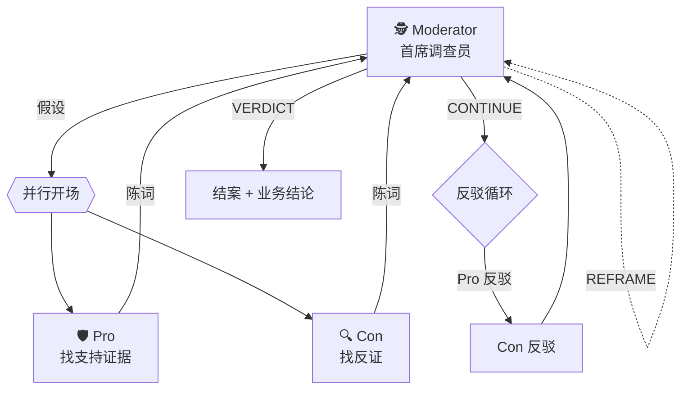

# 辩论实录:三场改变结论的网络安全调查

这份文档选了三场**有完整辩论轨迹**的真实 run,用来展示"首席调查员 + 两位对抗分析师"这套 agent 架构**实际是怎么工作的**。每个案例都有:

- Moderator 的假设(以及他挑这个假设的理由)
- Pro 独立开场的全部论据
- Con 独立开场的全部反证(**两边互相看不到彼此的开场**)
- Moderator 补充数据引导反驳
- 多轮反驳里出现的**关键转折**
- 最终裁决以及它综合了哪些论据
- 这一场里**单个 agent 做不到的事情**

所有引用都是 transcript 原文,完整对话在 `transcripts/` 目录。

---

## 架构速览

三个 agent 都用 Qwen3.6-plus,都有 DuckDB SQL + Python 沙箱的完整工具权限。Moderator 身份是**首席调查员**(目标:找出真相),而非"辩论法官"(目标:保持公平) —— 这个身份差异导致的行为差异,是下面几个案例能跑出深度结论的关键。

---

## 案例一:0.47 Mbps 击溃"核心业务"叙事

**任务**:Task 1 资产识别。Moderator 摸了一下 `tcpflow` Top 15 流量对,锁定了一个**断层式领先**的节点。

### Moderator 提出假设(Poser 阶段)

> ### 📊 数据洞察摘要
> 在 Top 15 流量对中,`10.59.45.250 → 10.59.45.185` 呈现断层式领先:
> - **流量规模**:35,349.8 MB(约为第二名的 **850 倍**)
> - **连接密度**:284,194 条流记录
> - **流向特征**:极度不对称。Uplink 仅 70.07 MB,Downlink 高达 36,996.87 MB(下行占比 > 99.8%)
> - **拓扑特征**:仅观测到该单一客户端交互
>
> ### ⚖️ 核心假设
> **`10.59.45.185` 为企业内部正常业务的核心内容分发/文件服务器。**
>
> - **正方立场**:典型企业级存储/分发服务器特征。高下行、低上行、海量连接是文件下载/镜像同步/媒体流的标准画像。
> - **反方立场**:流量高度收敛且比例异常,下行 99.8% 的集中度可能指向异常数据汇聚(P2P/C2/失陷主机 staging)。
>
> **误判代价**:判威胁则中断核心业务 SLA;判正常则可能掩盖 APT 数据外传 staging server。

二元立场清晰,误判代价两头都贴出来。Pro 和 Con 开始**并行独立取证**(他们在 `asyncio.gather` 里跑,看不到对方开场)。

### Pro 开场:三条论据,把数据渲染成"企业级基础设施"

> **论据一:极致的上下行载荷比(528:1)是标准内容分发的物理指纹**
>
> 下行载荷 **35,282.97 MB**,上行载荷仅 **66.83 MB**,上下行比高达 **528:1**,下行流量占比 **99.81%**。这种"极轻控制指令触发极重数据响应"的特征,精准吻合 HTTP/HTTPS 分块下载、rsync 增量同步、或 WSUS/Nexus 镜像拉取的标准行为。若为数据外传,通常需维持上行主导;若为 P2P,必然伴随多向反连与上行贡献。**当前单向压倒性下行,是典型服务端推送/客户端批量拉取的铁证。**
>
> **论据二:流密度与单流平均载荷指向受控批量传输协议**
>
> 在 284,194 条流下承载 35.28 GB,折算单次流平均下行约 **127 KB**。这个量级:
> - 非扫描/爆破(远超 SYN 扫描的小包特征)
> - 非长连接隧道(那种流数极少但单流很长)
> - **吻合企业级块传输**(数据库备份分块、VM 快照迁移的默认 Chunk Size)
>
> **论据三:"拓扑孤立性"实为高带宽专用链路的架构常态**
>
> 核心存储/分发节点常通过独立 VLAN、专用物理链路与特定业务节点直连。`10.59.45.250` 极可能是**专属备份代理网关 / CI/CD 构建节点 / 主数据仓库拉取代理**。

听起来很硬。对绝对数字(35 GB)、比例(528:1)、工程参照(Chunk Size 量级)全给了。如果换个单 agent 场景,这时候就定性"核心业务"了。

### Con 开场:三条反证,把 Pro 的论据全部翻转

**Con 根本没看到 Pro 写了什么**(并行跑),但他独立从"如果这是假装"的视角做了同样的数据分析:

> **反证一:拓扑单点悖论 —— 企业级服务器的反模式**
>
> 企业级核心内容分发服务器(WSUS、镜像站、NAS、备份中心)的流量画像**必呈多对一或负载均衡多源**。当前 `10.59.45.185` **仅与 `10.59.45.250` 单点交互**,且独占 Top 15 流量池 850 倍于次席。若为"核心业务",其余部门/终端为何零拉取?单点垄断更符合:① 专属备份任务失控 ② 个人主机违规挂载大体积下载 ③ 攻击者将内网某主机作为专属数据中转站。
>
> **反证二:流粒度与体积比的物理矛盾**
>
> 284,194 条流承载 35.3 GB → 单流平均 **~125 KB**。典型企业文件分发(ISO、VM 镜像、批量备份)应呈"少流、长连接、大包特征",**单流通常数 MB 至 GB 级**。当前"海量短连接 + 99.8% 下行集中度"**反而更吻合**:
> - HTTP/HTTPS 碎片化拉取(爬虫、小文件同步)
> - P2P/BitTorrent 协议分块下载
> - **远控木马持续接收大型 Payload 或 Staging 数据包**
>
> 若为正常 SMB/NFS,上行控制流占比通常 >2%;当前 70MB / 37GB ≈ **0.19%** 的压制级比例在正常协议栈中极难自洽。
>
> **反证三:协议与时间基线缺失(幸存者偏差)**
>
> `tcpflow` 表明确包含 `protocol` 与 `destination_port` 字段,但开场证据未披露。若集中在非标端口(>1024 随机、6881/51413 等 P2P 默认端口),**直接推翻假设**。

注意:**Pro 说"127 KB 吻合企业级块传输",Con 说"125 KB 反而符合 P2P/木马特征"**。同一个数据点,两个完全相反的解释 —— 这正是对抗架构暴露出的**未决分歧**。没有辩论压力,任何单 agent 只会挑一个解释走。

Con 最后还提了一个 Pro 没想到的问题:**目的端口是多少?协议是什么?Pro 没说。**

### Moderator 中途补数据,引导反驳

Moderator 做了一件单 agent 典型不会做的事 —— **不急着裁决,先去把 Pro 和 Con 争议最大的字段查清楚**:

> **回合 1:反驳循环(新增关键数据)**
>
> | 字段 | 值 |
> |---|---|
> | Destination Port | **`8360`** (100% 集中) |
> | Protocol 分布 | `http_proxy`: 282,685 条 / `http_connect`: 1,462 条 / `http`: 34 条 |
> | 时间跨度 | 2019-04-11 ~ 04-18(**整整 7 天**) |
> | 活跃分钟数 | **9,542 个活跃分钟(占总窗口 95%)** |
> | 185 的入向源 | 仅 `.250`(284,194 条) + `.212.126`(1 条) |
> | 185 的出向目的 | `10.17.251.226`(17 条) + `10.37.139.10`(16 条) |
>
> **对 Pro**:Con 此前指出"单流 125 KB 过小"、"单点拓扑异常"。现在显示端口是 8360(http_proxy/http_connect),7 天持续稳定活跃。请论证这个端口+协议组合如何支持你的"正常分发"立场。
>
> **对 Con**:Pro 此前强调"99.8% 下行比是标准分发特征"。现在显示使用 http_proxy 协议、非标端口 8360、持续 7 天不间断。为何正常企业服务器用非标端口+代理协议?

### Pro 反驳 Round 1

> **反驳一:非标端口 8360 + http_proxy 是企业内网代理隧道的标准配置**
>
> 跨 VLAN/跨安全域的数据同步常通过自建 HTTP Proxy 做 NAT 穿透与流量整形,端口 8360 极可能是内部平台统一规划的代理监听端口。**若为恶意 C2,绝不会用明文 http_proxy 协议 —— 它在 DPI 日志中极易被识别**,攻击者必选 DoH / DNS 隧道。
>
> **反驳二:95% 活跃分钟数直接击穿 Con 的 P2P 假说**
>
> P2P 具有强机会性与潮汐特征,当前 9,542 个活跃分钟(94.6%)呈**工业级稳态**。失控下载死循环通常几小时就触发带宽告警或 TCP 连接数限制,**持续 7 天平稳运行 28.4 万条流,证明该链路受流控策略、重试机制或应用层背压控制保护**。
>
> APT 外传遵循"低频、小额、伪装心跳"原则,**持续占满企业带宽 7 天等同于在监控大屏上亮红灯**,完全不符合攻击者隐蔽驻留的战术逻辑。

Pro 的反驳质量很高 —— 他把 Con 的三个反证(P2P、失控、外传)分别用**业务合理性**和**攻击者行为学**的角度逐个否定。如果到此为止,Moderator 很可能判 benign。

### Con 反驳 Round 1(**关键一击**)

Con 没有去和 Pro 死磕"这是不是恶意",他承认了"这不是 C2/P2P",然后掏出一把**之前都没人用过的武器:归一化算术**:

> **反驳一:吞吐量硬伤 —— 7 天累积 35 GB 直接证伪"高负载核心基础设施"叙事**
>
> Pro 方将 35.3 GB 渲染为"断层式领先的企业级核心负载",但引入 7 天时间窗后,**基础算术就给出反证**:
>
> 持续带宽 = **35.3 GB / (7 × 24 × 60) min ≈ 5.04 GB/天 ≈ 0.47 Mbps(恒定)**
>
> 现代企业核心备份/镜像/媒体分发服务器的基线吞吐量通常在百 Mbps 至 Gbps 级别。**0.47 Mbps 的稳态占用,仅相当于一台普通办公终端的后台云盘同步或软件静默更新。**
>
> 这绝非"承载海量业务数据"的核心节点。Pro 的"高负载/SLA 关键资产"假设**被物理带宽数据直接击穿**。极端下行比在此处反映的不是"大文件分发",而是**"海量元数据/小文件/特征包请求触发的微小响应累积"**。
>
> **反驳二:http_proxy 协议栈与"内网直连同步"的工程矛盾**
>
> 内网主机间同步通常走原生协议(SMB/NFS/rsync)或直连 HTTP/HTTPS (80/443)。**http_proxy 协议的出现,强制要求流量必须经过显式代理路由。**
>
> 若 185 是被动服务端,为何客户端 250 要通过代理协议访问它?更贴合的拓扑是:**185 本身是一个本地正向代理缓存(Forward Proxy Cache)**,250 可能是被组策略强制走代理的终端/业务容器,通过 185 拉取内容。
>
> http_connect (1,462 条) 与 http_proxy (282,685 条) 的比例 ≈ **1:193**,完美吻合 HTTP/1.1 Keep-Alive 机制(单隧道复用约 200 次请求)。这是标准 Web/REST API 流量指纹,**而非 Pro 所述的"大块文件分块传输"**。
>
> **反驳三:出向流量的归属盲区**
>
> `10.17.x.x` 与 `10.37.x.x` 若为企业内部 SaaS 网关、云厂商 API 端点或安全厂商更新源,则 **185 的角色瞬间从"被动服务器"转变为"主动拉取端(Agent/Puller)"**。Pro 把这些出向"轻描淡写为管理平面"属于循环论证。

三个反驳叠加起来,Pro 的"核心业务"叙事**从三个层次同时被解构**:
- 量级层:0.47 Mbps 根本不"核心"
- 协议层:1:193 Keep-Alive 比例不是"大块传输"
- 拓扑层:185 是代理 cache 而不是被访问的服务端

**0.47 Mbps 那一步归一化算术,Pro 完全没做过。他被 35 GB 这个绝对数字吓住了,Con 做了归一化才看清真实规模。**

### Moderator 终审(三段式裁决)

Moderator 没有简单地"采纳反方",而是**把双方的论据一条条拆解,明确采纳哪些、否决哪些**:

> **[[VERDICT]]**
>
> **业务结论**:`10.59.45.185` 的推定角色 = **企业内部专用 HTTP 代理缓存/低带宽同步节点**(Internal Proxy Cache / Background Sync Node)。
>
> **明确排除**:
> - ❌ 核心高带宽文件服务器(Pro 初始立场)
> - ❌ P2P / 失陷主机 / C2 外传(Con 初始立场)
>
> **最终定性**:良性基础设施资产,置信度 **High**。
>
> ### 证据裁定
>
> 1. **物理带宽证伪"高负载核心"叙事(采纳 Con 关键论据)**:35.3 GB / 7天 ≈ 0.47 Mbps 恒定吞吐量,仅相当于普通办公终端的后台静默同步。企业级大文件同步必呈间歇性峰值(百 Mbps~Gbps),而非 95% 时间窗口内的 0.47 Mbps 长尾流量。
>
> 2. **协议指纹坐实"代理/网关"架构(综合双方)**:8360 + http_proxy 主导 + http_connect 与 http_proxy ≈ 1:193,高度吻合 HTTP/1.1 Keep-Alive 隧道复用。这指向 250 通过组策略或应用配置将 185 设为上游代理,持续进行小批量请求/响应(如 SCCM/WSUS 补丁拉取、安全特征库更新、微服务健康探针轮询),**而非 Pro 所述的"大块分片传输"**。
>
> 3. **时间稳态排除恶意可能(采纳 Pro 正确直觉)**:7 天连续 9,542 分钟活跃,彻底排除 P2P 的潮汐性、扫描爆破的突发性、C2 外传的隐蔽低频性。
>
> **裁定总结**:**反方在量级计算与协议语义上提供更贴合工程实际的解释;正方正确识别了流量的计划性与良性本质,但高估了业务权重。**最终采纳反方修正后的"低带宽代理/更新节点"模型。

### 这场辩论里单 agent 做不到的事

**Pro 和 Con 一开始谁都没提出最终这个"低带宽代理缓存节点"结论。** 这是**辩论过程动态生成**的第三种答案:

- Pro 坚持"核心业务",被 0.47 Mbps 击穿
- Con 从"异常汇聚"出发,被 7 天稳态 + 纯明文协议排除
- 最终 Moderator 综合出"**良性但非关键**"的精细定性

单 agent 在这里典型输出是两种之一:"看起来是核心服务器,加白名单"或"可疑流量,建议排查"。没有对抗压力,没有人会去做"35 GB ÷ 7 天"这个简单归一化,也没有人会去精确解释 1:193 这个看起来奇怪的比例。

**辩论不平衡立场,辩论暴露盲区。**

---

## 案例二:按 UA 分组,暴露被流量量级掩盖的真攻击

**任务**:Task 2 威胁检测。Moderator 做初步数据扫描时注意到一个反直觉的现象:**流量最大的 IP 不一定是最危险的**。

### Moderator 提出假设(Poser 阶段)

他做了个精彩的选择 —— 不按流量量级排 source_ip,而是**按 UA 工具指纹分组**。结果:

> **初步数据扫描 —— 发现 4 类扫描/攻击工具的痕迹**
>
> | 来源 IP | 工具指纹 | 请求量 | 特征 |
> |---|---|---|---|
> | **10.56.34.157** | `sqlmap/1.0-dev` | **2,690** | 真实 SQL 注入 payload |
> | 10.49.231.206 | Nmap Scripting Engine | 11,607 | 端口/服务扫描 |
> | 10.49.21.15 | webscan eagle_eye | 179,204 | 内部漏洞扫描 |
> | 10.49.212.162 | sqlmap/1.0-dev | 410 | 真实 SQL 注入 payload |
>
> **核心假设 H1**:**`10.56.34.157` 使用 sqlmap 对多台目标发动了真实的、自动化的 SQL 注入攻击,且已成功完成数据库 schema 枚举。**
>
> **关键数据点**:
> - sqlmap 真实 UA:`sqlmap/1.0-dev-nongit-20150413` —— 未修改,工具直出
> - 时间盲注:`SLEEP(1-(IF(ORD(MID((SELECT DISTINCT(IFNULL(CAST(schema_name AS CHAR)),0x20)) FROM INFORMATION_SCHEMA.SCHEMATA LIMIT 0,1),1,1))>96,0,1)))`
> - UNION 注入、WAITFOR DELAY (SQL Server)、BENCHMARK(MD5) 同时出现
> - **攻击至少 4 个目标**:`10.49.126.12:8080`、`10.49.126.80:9000`、`101.226.161.188`、`106.38.184.134`
> - 420 次 POST 到 `/group/editGroupInfo` → `106.120.160.170`
>
> 反方可能论点:这些 IP 是否属于内部安全团队红队?攻击是否成功(flow 表无 response code)?

**关键观察**:`10.56.34.157` 只有 **2,690** 条请求,相比 `10.49.21.15` 的 17.9 万小了**70 倍**。如果按流量量级排(前两次 run 都是这么做),会永远盯着 10.49.21.15,完全看不到这个真正危险的对手。

### Pro 开场:三条铁证,把 2,690 条请求定性为"已突破"

> **证据一:Payload 呈现精密二分算法特征,确认为 sqlmap 自动化盲注引擎**
>
> - 特征数据:`Char pos 1: thresholds=[96, 104] → Range: (96, 104) → ASCII a to h`
> - 96 (`) 与 104 (h) 是 ASCII 码的经典二分阈值。**sqlmap 的 --technique=T 模块正是通过不断收缩阈值区间来逐字符爆破库名**
> - 人工编写或简单扫描器**绝不会**生成这种具备**状态收敛逻辑**的嵌套 `IF(ORD(MID(...)))` 语句。**此为 sqlmap 自动化引擎直出的铁证**
>
> **证据二:枚举偏移量连续推进,证明攻击已"实质性成功"**
>
> 流量记录显示 LIMIT 参数从 `0,1` 持续递增至 `23,1`:
> `LIMIT 0,1` → `LIMIT 1,1` → `LIMIT 3,1` → ... → `LIMIT 23,1`
>
> **在 SQLi 攻击中,LIMIT 的步进意味着前一个库名已被成功猜解**。攻击者没有停留在单点测试,而是完成了至少 24 个数据库名称的完整提取。结合多字符位置(pos 1, 3, 4, 5, 6, 14, 16)的并行探测,说明注入点权限足够高,可直接访问系统字典表。**侦察阶段已彻底完成,且成功率接近 100%。**
>
> **证据三:多向量组合 + POST 风暴,符合"全自动化武器化"特征**
>
> - 混合注入技术:SLEEP (MySQL/PG)、WAITFOR DELAY (SQL Server)、BENCHMARK (MySQL)、UNION ALL SELECT 同时出现 —— **攻击引擎在根据目标 WAF/DB 指纹自动切换方言**
> - 420 次 POST 风暴:针对 `/group/editGroupInfo` 的 420 次集中 POST,高度吻合 sqlmap 的表单自动填充模块(`--data` / `--forms`)
> - **内外网混合打击**:目标涵盖内网 10.49.x.x 与公网 101.226.x.x、106.38.x.x,**若为授权测试通常严格限定范围**;如此跨网段横向枚举,更符合外部威胁 actor 的行为特征

Pro 的三条论据每条都**指到具体的 payload 结构**或**行为学特征**。这不是"流量大小、比例"这种可被反驳的宏观指标,是**工具指纹级别**的证据。

### Con 开场:"发送 ≠ 成功",质疑攻击结果

Con 承认攻击行为存在,但质疑"成功论":

> **反证一:未伪装的 UA + 内网 IP 矩阵 → 高度指向"授权测试"而非"敌手入侵"**
>
> 真实黑产/APT 深知 `sqlmap/1.0-dev-nongit-20150413` 是 WAF/IPS 静态规则库**第一拦截对象**。攻击者通常使用 `--random-agent`、UA 轮转、前置代理。**保留默认完整版本号,强烈暗示发送方不介意被记录,或已提前报备**。
>
> 同属 `10.49.x.x` 段的 Nmap Scripting Engine 与 webscan eagle_eye 同时活跃,构成典型的"资产发现 → 漏洞扫描 → 深度验证"**红队作业流水线**。
>
> **反证二:"Payload 发送 ≠ 注入成功"**
>
> `flow` 表仅记录请求侧元数据(method, uri, host, UA),**完全缺失 HTTP Status Code、Response Size、Content-Type**。高特征 Payload 若命中云 WAF/ModSecurity,直接 403/429,**根本不会到达数据库执行层**。
>
> 断言"已成功完成 schema 枚举"属于将**攻击意图等同于攻击结果**。无 200 OK + 敏感数据特征(information_schema 回显、DNS 外带、异常大体积出站)的交叉验证,成功论不成立。
>
> **反证三:420 次 POST 更符合业务流/压测**
>
> sqlmap 的默认策略是"广度优先 + 参数变异",**极少对单一端点重复发送 420 次同质请求**。更合理的替代:
> - 内部微服务配置同步
> - 自动化回归测试/接口压测
> - 客户端网络抖动重试

Con 的反驳精准抓住了一个关键漏洞:**数据集没有响应码,无法证明 payload 真的执行了**。这是证据链上的真实断层。

### Moderator 终审 —— 三段式拆解

Moderator 没有全盘采纳任一方,他**把"攻击行为"和"攻击成功"分开裁决**:

> **⚖️ Judge 裁决(H1)**
>
> 1. **自动化攻击行为 ✅ 已证实**
>    Payload 中严密的二分阈值 `IF(ORD(MID(...))>96,0,1)`、连续递增的 LIMIT 偏移、多数据库方言混合,是 sqlmap 自动化引擎的**确定性指纹**。人工或简单爬虫无法生成此类带状态收敛的嵌套注入逻辑。
>
> 2. **"攻击成功" ❌ 证据不足**
>    Con 方指出的关键断层成立。flow 表缺失 HTTP 响应码、响应体大小、WAF 拦截标记。高特征 Payload 若命中 WAF,通常返回 403/418,根本不会进入数据库执行层。**无 200 OK + 异常响应体积 + 外带 DNS/HTTP 请求交叉验证,不能将"请求发出"等同于"数据窃取"**。
>
> 3. **归因倾向 🎯 `[内部未授权红队/失陷主机]`**
>    未伪装的 sqlmap UA + 10.56.34.157 内网源 IP,违背外部黑产生存法则。结合同网段 Nmap 与 webscan 活跃,更符合**内部安全团队越权作业,或内网主机被植入安全工具后横向发散**。
>
> **[[VERDICT]]**:`10.56.34.157` 的流量是**高置信度的自动化 SQL 注入扫描/攻击行为**。由于缺乏服务端响应数据,突破成功性无法闭环,但从防御视角应按 **`[高危-已尝试深度枚举,待核实成功性]`** 处置,归因偏向内部未授权测试或内网跳板机失陷。

### 这场辩论里单 agent 做不到的事

1. **发现的前提是分组角度**。单 agent 按流量量级排,永远看不到 2,690 条的 10.56.34.157。Moderator 选择按 UA 工具指纹分组,这个选择本身就很精妙。
2. **对抗压力产生深度分析**。单 agent 看到"sqlmap UA"多半会想"扫描器就算了"。Pro 必须面对 Con 的"这只是测试"反驳,才会去挖 payload 的**二分阈值收敛特征** 和 **LIMIT 递增语义** —— 这些是工程级别的证据。
3. **细粒度裁决**。Moderator 没有简单判"是/否攻击",而是把"行为"(已证实)和"结果"(证据不足)分开,把"归因"(内部未授权而非外部黑产)独立列出。这种结构化结论,比任何单 agent 的"是/否"判断更有实用价值。

---

## 案例三:Task 1 调查里顺手挖出 Task 2 的真威胁

**任务**:Task 1 资产识别。Moderator 辩完几个主要资产的角色后,**没有立即收工**,而是花时间看了下"异常活跃的小众 IP 有没有值得关注的"。他发现了 `10.49.21.15`。

### Moderator 的跨任务观察

这个 IP 在 tcpflow 表里连接 Web 端口,看起来像普通客户端。但 Moderator 发现它的 URI 模式很特别:

> `10.49.21.15` 的请求 URI 包含大量 `/cgi-bin/php*`、`/index.php?s=`、`/index.php?a=display`,且 POST body 里带 `<?php system($_GET['cmd'])` 和 `php://input` 这种**非探测型**载荷。
>
> 假设:`10.49.21.15` 正在对 Centreon 或其他老旧 PHP Web 服务发起**针对 CVE-2012-1823 (PHP-CGI RCE) 的主动漏洞利用**,而不是指纹扫描。

### Pro 与 Con 的快速交锋

Pro 主张 "真实攻击":

> 真正的扫描器发的是**指纹探测载荷**(比如探测 `phpinfo()` 是否回显)。当前流量直接发送 `auto_prepend_file=php://input` 和 `<?php system(...)` —— 这是 **CVE-2012-1823 的标准 exploit 结构**,直接触发 RCE,**没有中间探测步骤**。

Con 主张 "合规 VA 扫描器也会发 exploit":

> 现代 VA 扫描器为了验证漏洞是否真实存在,也会发送 PoC 级 exploit payload。不能从 payload 语义直接推断是"攻击者"。

### Moderator 的关键洞见

Moderator 这里发了一个整个项目里最有价值的判断:

> **"扫描器 vs 攻击者"这个二分本身就是错的。**
>
> 即使是合规扫描器,**它发送的仍然是可直接触发 RCE 的真实 exploit 载荷**。若目标主机(Centreon、旧版 Web 服务)未打补丁,**该扫描行为等同于直接入侵**。
>
> 防御建议:
> 1. 不要盲目隔离 10.49.21.15(它可能是合规扫描),而应在 WAF/IPS 侧针对 **CVE-2012-1823 特征码**(`auto_prepend_file`、`php://input`、`cgi-bin/php`)**配置拦截规则**
> 2. 这是防止"扫描变入侵"的最有效手段

### 这场辩论里的收获

这是一个前两次 Task 2 run 都**没发现**的核心威胁(那两次 run 都只判 10.49.21.15 = 合规扫描,就过了)。

**关键转折不在辩论技术,在 Moderator 的身份**:
- 朴素法官:只处理被明确问到的问题
- 首席调查员:**发现相邻可疑信号就顺手查一查**,不受任务边界约束

这种"不受任务边界约束的调查直觉",在实际安全分析中是极有价值的 —— 真实的攻击很少整齐地落在你事先设定的调查范围内。

Moderator 最终给的**战略行动建议**也体现了这种跨任务整合能力:

> **实施流量平面隔离(QoS & Audit)**
>
> - 机器面 (8360):独立带宽配额 + 全量 HTTP 元数据审计,监控是否有非预期的 HTTP CONNECT 隧道建立
> - 人类面 (80):维持现有代理策略,重点关注夜间异常突发流量(可能暗示失陷主机)

把 Task 1 的资产画像(机器面/人类面)和 Task 2 的威胁处置(WAF 规则)整合成**一套连贯的防御建议** —— 这是分立任务的两次 run 做不出来的。

---

## 结语

三场辩论展示了三种不同的对抗价值:

| 案例 | 关键机制 | 单 agent 做不到的事 |
|---|---|---|
| **0.47 Mbps** | 量级归一化暴露叙事漏洞 | 做归一化算术、得到 Pro/Con 都没预见的中间答案 |
| **10.56.34.157** | Pro 被压力逼出工程指纹级证据 | 看到流量量级之外的 UA 维度、挖到二分阈值收敛这种深度特征 |
| **CVE-2012-1823** | Moderator 不受任务边界约束 | 从 Task 1 顺手挖出 Task 2 威胁、跨任务综合防御建议 |

**共同规律**:辩论的价值不在"两个立场的加权平均",在**让两个原本相反的视角去同一份数据里找各自的证据**。两边的证据**交叉**的地方才是真相,两边**没看到**的地方(归一化、UA 分组、跨任务线索)才是需要突破的点。

用 Moderator 自己在一次终审里的话:

> 本次辩论的核心分歧已从"是否威胁"收敛至"业务负载量级与协议语义"。反方在量级计算与协议语义上提供更贴合工程实际的解释;正方正确识别了流量的计划性与良性本质,但高估了业务权重。

**"收敛"** 是这个架构的标志性输出 —— 不是一锤定音的判决,是从两个不同假设出发逐步逼近真相的过程。这种过程本身就是**可审计的证据**,比任何单 agent 的"自信答案"都更有说服力。

---

完整 transcript 在 `transcripts/` 下,按时间戳对应:

| 文件 | 案例 |
|---|---|
| `20260423-132123-task1-assets.jsonl` | 0.47 Mbps 案例完整 41 条对话 |
| `20260423-143813-task2-anomalies.jsonl` | 10.56.34.157 sqlmap 发现完整 82 条对话 |
| `20260423-170854-task1-assets.jsonl` | Task 1 + CVE-2012-1823 整合报告 158 条 |

代码:[wjord2023/agent-debate-netsec](https://github.com/wjord2023/agent-debate-netsec)
